# HYBO | iLidar-ToF | iTFS Series User Manual (EN)
V 1.1.4 (21- Nov.-2024)

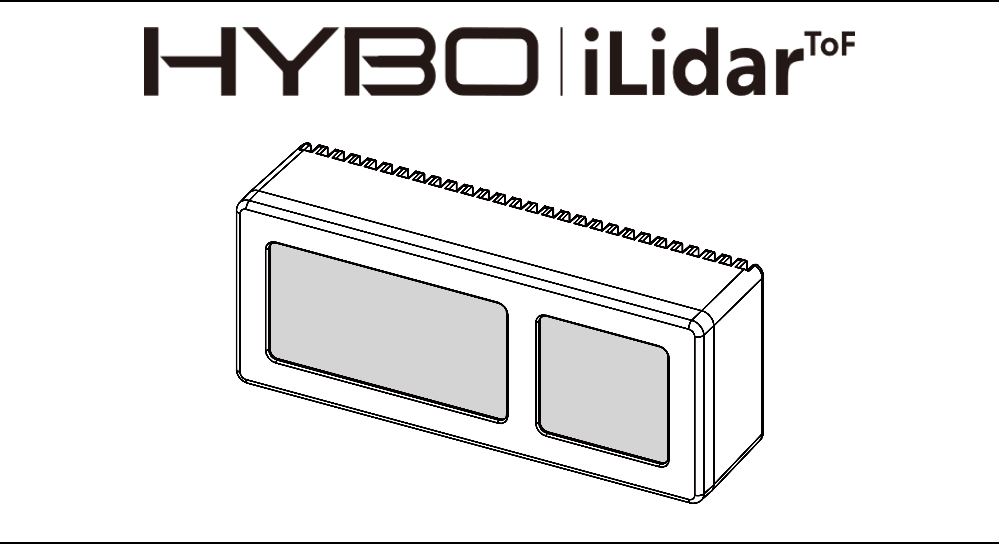

# INDEX
- [INDEX](#index)
- [1. Important Information](#1-important-information)
  - [1-1. Notification](#1-1-notification)
  - [1-2. Warnings](#1-2-warnings)
  - [1-3. Legal Notices](#1-3-legal-notices)
    - [1-3-1. Laser Safety](#1-3-1-laser-safety)
    - [1-3-2. Hot Surface Warning](#1-3-2-hot-surface-warning)
  - [1-4. Certifications](#1-4-certifications)
    - [1-4-1. KC](#1-4-1-kc)
    - [1-4-2. CE](#1-4-2-ce)
    - [1-4-3. IEC 60825-1:2014](#1-4-3-iec-60825-12014)
- [2. Sensor Overview](#2-sensor-overview)
  - [2-1. iLidar-ToF](#2-1-ilidar-tof)
  - [2-2. Fundamentals of Indirect Time-of-Flight Sensors](#2-2-fundamentals-of-indirect-time-of-flight-sensors)
  - [2-3. Known Limitations](#2-3-known-limitations)
    - [2-3-1. Multi-Path Error](#2-3-1-multi-path-error)
    - [2-3-2. Scattering](#2-3-2-scattering)
  - [2-4. Specifications](#2-4-specifications)
    - [2-4-1. Differences by model](#2-4-1-differences-by-model)
    - [2-4-2. Commonalities](#2-4-2-commonalities)
- [3. Mechanical Parts](#3-mechanical-parts)
  - [3-1. What's in the box?](#3-1-whats-in-the-box)
  - [3-2. Mechanical Drawing](#3-2-mechanical-drawing)
  - [3-3. Installation Guidelines](#3-3-installation-guidelines)
- [4. Electrical Connection](#4-electrical-connection)
  - [4-1. Pinout](#4-1-pinout)
  - [4-2. Power](#4-2-power)
    - [4-2-1. Connection Example with PoE](#4-2-1-connection-example-with-poe)
    - [4-2-2. Connection Example with 12VDC](#4-2-2-connection-example-with-12vdc)
- [5. Sensor Operation](#5-sensor-operation)
  - [5-1. Network Configuration](#5-1-network-configuration)
    - [5-1-1. Windows](#5-1-1-windows)
    - [5-1-2. Linux(Ubuntu)](#5-1-2-linuxubuntu)
  - [5-2. iViewer:Simple iLidar Data Viewer](#5-2-iviewersimple-ilidar-data-viewer)
- [6. Packets and Parameters](#6-packets-and-parameters)
  - [6-1. Basic Packet Structure](#6-1-basic-packet-structure)
  - [6-2. List of ID](#6-2-list-of-id)
  - [6-3. IMG Packet](#6-3-img-packet)
  - [6-4. STATUS Packet](#6-4-status-packet)
  - [6-5. STATUS\_FULL Packet](#6-5-status_full-packet)
  - [6-6. INFO Packet](#6-6-info-packet)
  - [6-7. INFO\_V2 Packet](#6-7-info_v2-packet)
  - [6-8. CMD Packet](#6-8-cmd-packet)
  - [6-9. SYNC\_ACK Packet](#6-9-sync_ack-packet)
- [7. How to Handle Image and Point Cloud](#7-how-to-handle-image-and-point-cloud)
  - [7-1. Image Data](#7-1-image-data)
    - [7-1-1. Capture Row](#7-1-1-capture-row)
    - [7-1-2. Binning](#7-1-2-binning)
    - [7-1-3. Accumulating Image Packet](#7-1-3-accumulating-image-packet)
  - [7-2. Point Cloud](#7-2-point-cloud)
    - [7-2-1. Image Coordiantes to LiDAR Local Coordinates](#7-2-1-image-coordiantes-to-lidar-local-coordinates)
    - [7-2-2. LiDAR Local Coordinates to World Coordinates](#7-2-2-lidar-local-coordinates-to-world-coordinates)
- [8. Software Examples](#8-software-examples)
- [9. Configuration](#9-configuration)
  - [9-1. Configuration Process](#9-1-configuration-process)
  - [9-2. HDR Configuration](#9-2-hdr-configuration)
- [10. Synchronization](#10-synchronization)
  - [10-1. Multi-sensor Synchronization](#10-1-multi-sensor-synchronization)
  - [10-2. Synchronization Methods](#10-2-synchronization-methods)
    - [10-2-1. UDP Synchronization](#10-2-1-udp-synchronization)
    - [10-2-2. Trigger Synchronization](#10-2-2-trigger-synchronization)
    - [10-2-3. Optical Synchronization (in development)](#10-2-3-optical-synchronization-in-development)
  - [10-3. Fine-Tuning Time Window](#10-3-fine-tuning-time-window)
  - [10-4. Multi Sensor Examples](#10-4-multi-sensor-examples)
- [11. Sensor Maintenance Guide](#11-sensor-maintenance-guide)
  - [11-1. Hardware Maintenance and Safety Guide](#11-1-hardware-maintenance-and-safety-guide)
    - [11-1-1. Electrical Requirements and Safety Conditions](#11-1-1-electrical-requirements-and-safety-conditions)
    - [11-1-2. Temperature and Heat Dissipation](#11-1-2-temperature-and-heat-dissipation)
    - [11-1-3. Optical Windows](#11-1-3-optical-windows)
  - [11-2. Warning Code](#11-2-warning-code)
  - [11-3. Factory Reset](#11-3-factory-reset)
- [12. FAQ](#12-faq)
  
# 1. Important Information
## 1-1. Notification
- Using this product implies agreement to the guidelines and precautions specified in this document.
- Before using the product, ensure you understand and adhere to the safety regulations and operating instructions. Improper usage may result in product malfunction, injury, or property damage. Carefully review all related materials (e.g., Quick Start Guide, User Manual) before initial use.
- Users are responsible for any risks or damages arising from the use of the product, accessories, or related materials. HYBO Inc. is not liable for any direct or indirect injuries, damages, or legal disputes caused by the product's usage. Users agree to take full responsibility for any harm or damages resulting from the product's use or inability to use. To prevent accidents, users must follow the safety and operational guidelines provided.

## 1-2. Warnings
- Review and understand the safety guidelines and operating instructions before using the product. Improper use may damage the device, cause malfunction, injury, or property damage. Carefully read all related materials before first use.
- Do not disassemble, modify, or repair the product under any circumstances. Particularly, tampering with the optical part emitting the laser may cause severe eye damage and is strictly prohibited. If performance adjustments are required, contact HYBO Inc. for customizations instead of modifying the product.
- Viewing a damaged optical window at close range may result in eye injury. Inspect the front optical window before using the product. If damaged, cease use immediately and disconnect power. Wear protective eyewear designed for LASER CLASS 3R if close proximity is unavoidable.
- Do not operate the product if the front optical window is damaged. Contact HYBO Inc.’s A/S center for support.
- Avoid pressing the optical window with sharp objects such as nails or screwdrivers, as it may cause dents that lead to measurement errors or product damage. If foreign substances like water droplets or dust are present on the optical window, clean it with a soft cloth to maintain its condition. Contaminants on the window may lead to inaccurate measurements.
- Do not cover the front optical window with objects like stickers or covers, as it may result in measurement inaccuracies. Follow the installation guide for keep-out zones when installing products designed for mounted use.
- Minor surface irregularities or scratches on the optical window are normal and do not affect functionality.
- Handle the product with care to avoid damage caused by dropping.
- When using the 12VDC power via the I/O connector, ensure correct pin mapping for proper connection. Incorrect wiring may cause product failure, and such damage is not covered under warranty.
- Use cables approved by HYBO Inc. to prevent potential product damage.
- Avoid connecting wet cables or connectors, as this may damage the product.
- During operation, the product may generate heat due to the light source. The rear surface may reach approximately 60°C in normal indoor environments. If excessive heating occurs, consider attaching the rear mount holes to a heat-dissipating metal plate to release the heat.

## 1-3. Legal Notices
### 1-3-1. Laser Safety
- The iTFS series uses an invisible infrared laser light source with a wavelength of 940 nm. It is classified as a CLASS 1 laser product under the KS C IEC 60825-1:2014 standard, in compliance with international safety standards IEC 60825-1.

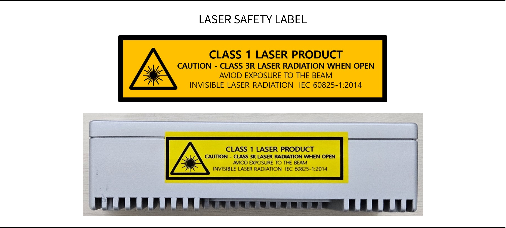

- Although CLASS 1 lasers are safe for the eyes, avoid prolonged direct viewing of the front optical window (emission area). Do not observe the emission area using optical instruments.
- If the front optical window is removed, the product may emit CLASS 3R level laser radiation. Always adhere to safety warnings and never disassemble the optical window or front cover.

### 1-3-2. Hot Surface Warning
- The iTFS series generates heat during operation due to its light source. The rear surface temperature may reach approximately 60°C under standard room conditions, which is normal. However, touching the rear surface when excessively heated may cause burns. Monitor the product's temperature, and if needed, attach the rear mount holes to a heat-conductive metal plate to dissipate heat.

## 1-4. Certifications
- The iTFS series complies with domestic and international electronics regulations and has obtained the following certifications.

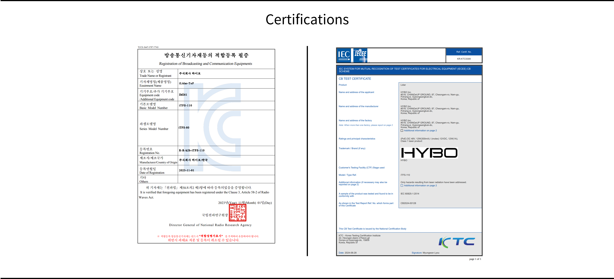

### 1-4-1. KC
- The iTFS series has received KC certification under Korea’s Radio Wave Act. Relevant details are listed below.

|     Item      |            Certification Details             |
| :-----------: | :------------------------------------------: |
|     Company    |                HYBO Inc.              |
|   Product Name |                  iLidar-ToF                 |
|    Model      |           iTFS-110 / iTFS-80                |
| Certification No. |           R-R-h2b-iTFS-110               |
| Manufacturer  |                HYBO Inc.              |
| Manufacturing Country |             South Korea              |
| Manufacturing Date |     YYYY-MM (Refer to hard copy document)       |
| A/S Center   |                   +82-2-597-4905                |

### 1-4-2. CE
- TBD

### 1-4-3. IEC 60825-1:2014
- The iTFS series complies with the IEC 60825-1:2014 standard for eye safety and has obtained international certification under the CB Scheme. Details are as follows:

|    Item      |          Details           |
| :--: | :--: |
| Report Number | CB2024-00128 |
| Date of issue | June 28, 2024 |
| Standard | IEC 60825-1:2014 |
| Test procedure | CB Scheme |
| Test item | Lidar |
| Manufacturer | HYBO |
| Model/Type reference | iTFS-110 |
| Ratings | (PoE) DC 48V, 12W(300mA) / (molex) 12VDC, 12W(1A) |
| Class | Class 1 laser product |

# 2. Sensor Overview
## 2-1. iLidar-ToF
- The iLidar ToF: iTFS is a 3D solid-state LiDAR that offers a cost-effective solution compared to existing LiDAR sensors in the market. It features a solid-state design with no moving parts and a high-efficiency optical system, achieving a maximum measurement range of up to 20 m.
- The iTFS series can be used for obstacle avoidance in mobile robots and monitoring human presence in hazardous zones in industrial environments. It is also suitable for various applications, such as detecting vehicle entry in parking lots.
- One of the key advantages of the iTFS series is the modular design of its optical components. By replacing the optical module, the sensor maintains its form factor while offering various specifications. This allows users to adjust the sensor's performance for different environments and applications.

## 2-2. Fundamentals of Indirect Time-of-Flight Sensors
- The iLidar ToF: iTFS measures distances using the indirect ToF (iToF) method. The transmitter emits amplitude-modulated continuous wave (AMCW) light using a laser diode, which reflects off the measured object and returns to the sensor. The receiver's ToF image sensor decodes the light at the same frequency as the transmitter. Finally, the phase difference (Δ𝜃) between the transmitted and received modulation is calculated, and the distance is determined using the formula:

> $$d = \frac{c}{2} \cdot \frac{\Delta \theta}{2 \pi f}$$

Where:  
- $f$: AMCW frequency  
- $c$: Speed of light  
- $d$: Distance to the object  

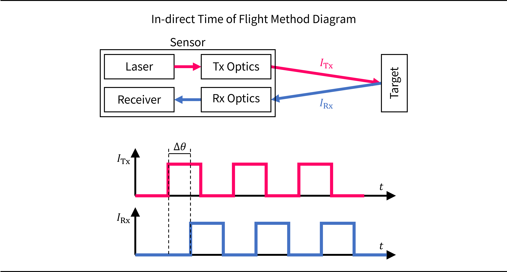

## 2-3. Known Limitations
The iLidar ToF: iTFS sensor uses the iToF method for distance measurement, which is subject to the following known limitations. Be aware of these factors that may introduce measurement errors when using the iTFS sensor.

### 2-3-1. Multi-Path Error
- One known limitation of iToF distance measurement is multi-path error. As illustrated below, light emitted from the transmitter can reflect off an object and return to the sensor via different paths. For example, Path 1 involves a single reflection, while Path 2 involves multiple reflections. This can cause the ToF image sensor to register a distance value that is greater than the actual distance in the given direction.
- Additionally, if there is a transparent object, such as glass, in front of the sensor, light passing through the glass may interfere with the light reflected by the object. This can result in depth values being measured somewhere between the glass and the object.

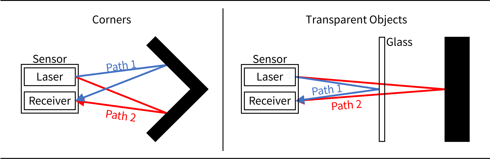

### 2-3-2. Scattering
- Scattering occurs when light reflects internally within the iToF sensor's receiver. This phenomenon typically arises when there is an object very close to the sensor or when highly reflective objects, such as mirrors, are present. Scattering can cause errors in depth values. For instance, interference between weak signals from distant objects and scattered signals from nearby objects can make distant objects appear closer than they are.

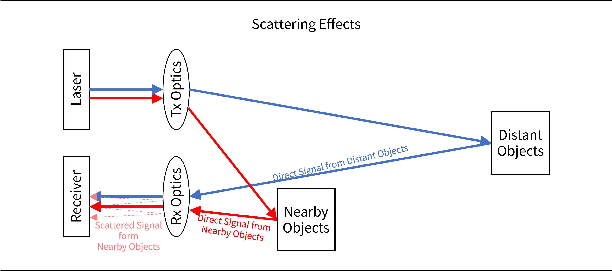

## 2-4. Specifications
### 2-4-1. Differences by model
|      Features       |   iTFS-110    |    iTFS-80    |
| :-----------------: | :-----------: | :-----------: |
|   Range (mode 1)    | 0.30 ~  8.0 m | 0.30 ~ 10.0 m |
|   Range (mode 2)    | 0.05 ~ 12.0 m | 0.05 ~ 15.0 m |
|   Range (mode 3)    | 0.05 ~ 16.0 m | 0.05 ~ 20.0 m |
| Resolution (mode 1) |  0.4° × 0.4°  |  0.3° × 0.3°  |
| Resolution (mode 2) |  0.4° × 0.8°  |  0.3° × 0.6°  |
| Resolution (mode 3) |  0.8° × 0.8°  |  0.6° × 0.6°  |
|         FoV         |  110° × 60°   |   80° × 45°   |
- On-the-fly configuration available (mode, framerate, and output data)
- Range: Measured at centered ROI by using 80% diffuse-reflective target
- FoV: Range-guaranteed scope. Working horizontal FoVs are 120° and 90° for iTFS-110 and iTS-80 respectively.

### 2-4-2. Commonalities
|     Features      |                    iTFS-110 & iTFS-80                    |
| :---------------: | :------------------------------------------------------: |
|     Accuracy      |   Error level: ± (3~5 cm + 2% of distance measurement)   |
|     Framerate     | Typ. 12.5 Hz (Up to 20 Hz with heatsink and reduced RoI) |
|    Dimensions     |               115.0 mm × 46.0 mm × 31.5 mm               |
|      Weight       |                         200.0 g                          |
|       Power       |         Avg. 6.0 W / Max. 12.0 W (12VDC or PoE)          |
|     Interface     |                UDP (RJ-45) / UART (Molex)                |
|      Output       |                Depth and Intensity Images                |
|   Certification   | IEC 60825-1:2014, KC(R-R-h2b-iTFS-110), CE(Comming soon) |
| Sunlight Immunity |       ~ 33 klux (80% ranging performance @ mode2)        |
|   Illumination    |                     940-nm IR Laser                      |
|    Eye safety     |           CLASS 1 (based on IEC 60825-1:2014)            |

# 3. Mechanical Parts
## 3-1. What's in the box?

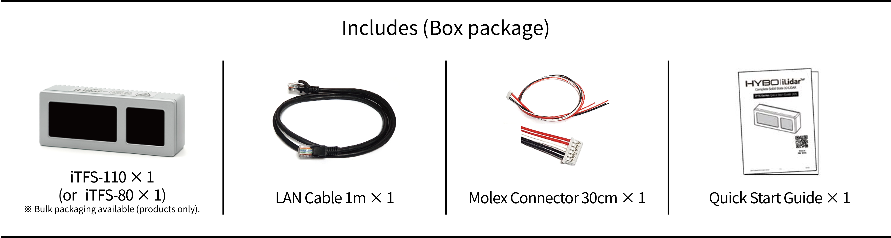

- The package includes the following items along with a quality assurance certificate:
- **1 iTFS-110 (or iTFS-80):** The main LiDAR unit. Be sure to remove the protective tape covering the product before use.
- **1 LAN cable (1m):** A LAN cable for receiving LiDAR data. The iTFS series requires a communication speed of at least 100 Mbps. Therefore, use UTP cables rated CAT.5 or higher. The included LAN cable is a CAT.5e UTP cable. When using PoE to power the LiDAR, no additional connection lines are needed.
- **1 Molex connector (30cm):** A supplementary functionality cable for connecting to the 12VDC terminal if PoE is not used. It also supports Trigger/Strobe functions. The included connector's part number is Molex 51021-0600, and it comes with a half-cut cable containing flame-retardant wires of 22 AWG or higher. If configuring the cable yourself, verify compatibility using the provided specifications.

## 3-2. Mechanical Drawing

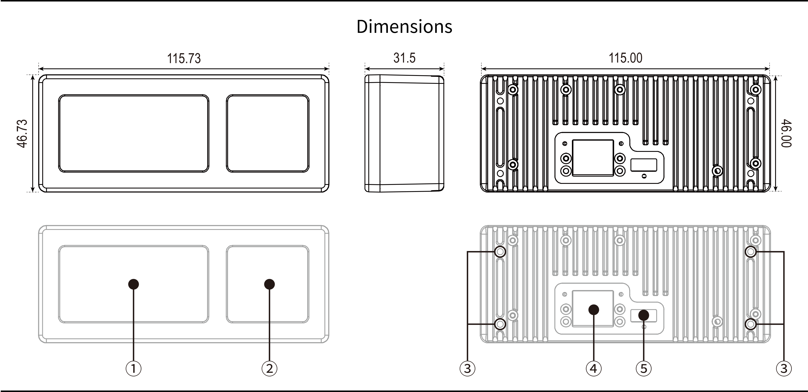

- The dimensions and components of the iTFS series are as follows (units: mm):
1. Optical window (transmitter)
1. Optical window (receiver)
1. Mounting screw holes, M3, 4-mm depth
1. Data RJ45 connector, supports PoE
1. I/O connector, Molex pico-blade, 6-pos
- A [3D CAD model (STL)](https://www.ilidar.io/) is available for use in designs.

## 3-3. Installation Guidelines

- To maximize performance, install the iTFS series considering the model-specific keep-out zones shown below (units: mm).

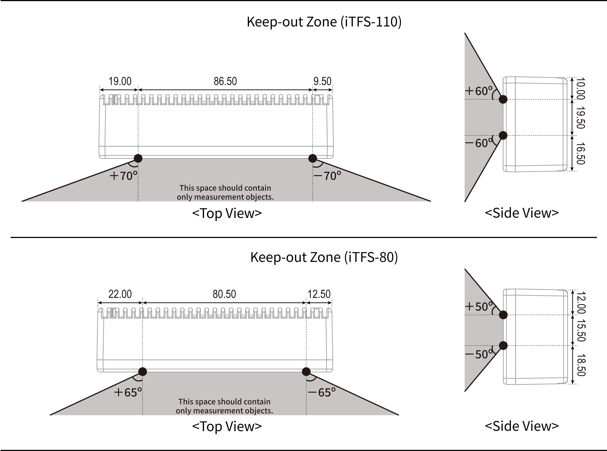

- The product's rear features screw holes (M3, 4-mm depth) for mounting. Refer to the screw hole positions below for integration into your design.

# 4. Electrical Connection
## 4-1. Pinout
- The iTFS series has an RJ45 connector and a 6-pin Molex pico-blade. The RJ45 port is used for power (PoE) and data transmission, while the 6-pin Molex pico-blade is for power supply (12V DC) and TRIGGER/STROBE functionality.

- The RJ45 port on the iTFS supports PoE and PoE+ standards. Ensure the power supply complies with **IEEE802.3af/at** standards when using PoE.  
- The connection details for the Molex I/O pins are as follows:

| Pin |  Name   | I/O |      Rating / Description      |
| :-: | :-----: | :-: | :----------------------------: |
|  1  |  12VDC  |  I  | 12V (Min. 11.6 V, Max. 12.4 V) |
|  2  |  12VDC  |  I  | 12V (Min. 11.6 V, Max. 12.4 V) |
|  3  | TRIGGER |  I  |  TTL (Typ. 3.3 V, Max. 5.0 V)  |
|  4  | STROBE  |  O  |          TTL (3.3 V)           |
|  5  |   GND   |  I  |              GND               |
|  6  |   GND   |  I  |              GND               |

## 4-2. Power

- The iTFS series operates on an average power of 6 W, with a maximum of 12 W. It supports both integrated PoE power supply and direct power supply through a 12VDC terminal for user convenience. Choose your preferred method to connect the power and LAN cable for operation. (Note: Using PoE may cause the sensor's overall temperature to be approximately 4°C higher than with a 12VDC power supply.)
  - **PoE:** Utilize the RJ45 port; supports PoE and PoE+ standards.
  - **12VDC:** Use the 6-pin Molex pico-blade for power supply.

### 4-2-1. Connection Example with PoE

- PoE power can be supplied using a PoE-enabled switch or PoE injector. Refer to the diagram below for configuration. (No additional line connections are needed when using PoE for powering the LiDAR.)

### 4-2-2. Connection Example with 12VDC

- Connect 12VDC using the Molex connector to power the device. Refer to the diagram below for configuration.

# 5. Sensor Operation
## 5-1. Network Configuration
- The iTFS sensor communicates with connected devices via UDP, requiring the correct network settings for proper data reception. Configure the LAN port’s IP address based on the operating system as follows. The listed IP address corresponds to the sensor’s default settings; if the sensor’s IP address has been changed, use the updated value.

### 5-1-1. Windows
- Open the network properties of the Ethernet device connected to the iTFS sensor.
- Select Internet Protocol Version 4 (TCP/IPv4) and configure the IP address and subnet mask. The default values are:
> IP Address: `192.168.5.2`
> Subnet Mask: `255.255.255.0`
3. The first time you run iTFS-related software in a Windows environment, a Windows Security Alert may appear. Allow all communication in this window to ensure proper operation (the appearance of the dialog may vary by Windows version).

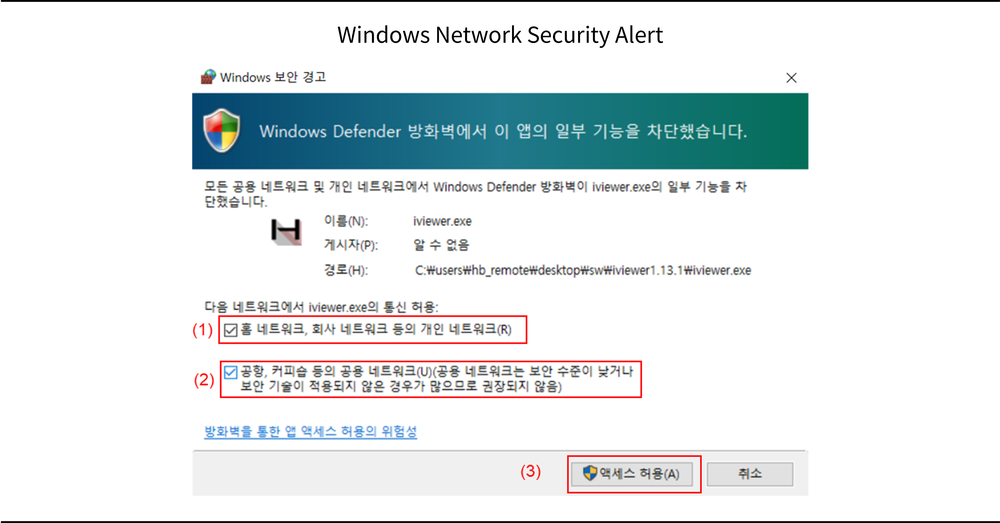

### 5-1-2. Linux (Ubuntu)
- Access the settings of the LAN port connected to the iTFS sensor.
- Under the IPv4 tab, select manual configuration and set the IP address and subnet mask. The default values are:
> IP Address: `192.168.5.2`
> Subnet Mask: `255.255.255.0`

## 5-2. iViewer: Simple iLidar Data Viewer
- iViewer is a real-time data viewer for iLidar-ToF sensors, enabling sensor connection, data visualization, and parameter configuration. The latest version of iViewer can be downloaded from the [iLidar-ToF GitHub page](https://github.com/ilidar-tof/iviewer).

# 6. Packets and Parameters
## 6-1. Basic Packet Structure
- The iTFS sensor communicates data via UDP packets, with the following structure (index and size in bytes):

|  Name   | Index | Size |  Type  | Value | Description    |
| :-----: | :---: | :--: | :----: | :---: | :------------- |
|  STX0   |   0   |  1   | uint8  | 0xA5  | Preamble       |
|  STX1   |   1   |  1   | uint8  | 0x5A  | Preamble       |
|   ID    |   2   |  2   | uint16 |   -   | Packet ID      |
|   LEN   |   4   |  2   | uint16 |   N   | Payload Length |
| PAYLOAD |   6   |  N   |   -    |   -   | Data Field     |
|  ETX0   |  N+6  |  1   | uint8  | 0xA5  | Postamble      |
|  ETX1   |  N+7  |  1   | uint8  | 0x5A  | Postamble      |

- **STX**: Indicates the start of the packet.
- **ID**: Identifies the packet type.
- **LEN**: Specifies the payload length in bytes.
- **PAYLOAD**: Contains data specific to the packet type (details in subsections).
- **ETX**: Indicates the end of the packet.

## 6-2. List of IDs
- The list of IDs used in the packet structure is as follows:

|    Name     |   ID   | LEN  |    Direction    | Description                        |
| :---------: | :----: | :--: | :-------------: | :--------------------------------- |
|     IMG     | 0x0000 | 1282 | Sensor →   User | Image Data (Depth and Intensity)   |
|   STATUS    | 0x0010 |  28  | Sensor →   User | Sensor Operation Status            |
| STATUS_FULL | 0x0011 | 312  | Sensor →   User | Sensor Operation Status (extended) |
|    INFO     | 0x0020 | 110  | Sensor ↔   User | Sensor Information                 |
|   INFO_V2   | 0x0021 | 166  | Sensor ↔   User | Sensor Information (V2)            |
|     CMD     | 0x0030 |  4   | Sensor ←   User | Command Packet                     |
|  SYNC_ACK   | 0x0012 |  26  | Sensor →   User | Sensor Synchronization Status      |

## 6-3. IMG Packet
- The IMG packet is used to transmit depth or intensity images captured by the sensor to the user. The images are transmitted line by line. The PAYLOAD structure of the IMG packet is as follows.
- To reconstruct a complete image from the IMG packets, refer to [7. How to Handle Image and Point Cloud](#7-how-to-handle-image-and-point-cloud) for detailed instructions.

|   Name    | Index | Size |  Type  |
| :-------: | :---: | :--: | :----: |
| row_index |   0   |  1   | uint8  |
|  mframe   |   1   |  1   | uint8  |
|  data[0]  |   2   |  2   | uint16 |
|  data[1]  |   4   |  2   | uint16 |
|     ⋯     |   ⋯   |  ⋯   |   ⋯    |
| data[639] | 1280  |  2   | uint16 |

- **row_index**: Indicates the sequence of the image line being transmitted. Images are transmitted line by line.
- **mframe**: Contains the capture mode and frame information of the current packet, with data structured as follows:

| Bit  | 7:6 (2 bits) |    5:0 (6 bits)     |
| :--: | :----------: | :-----------------: |
| Data | capture_mode | capture_frame_short |

  - **capture_mode**: Specifies the sensor's capture mode.
  - **capture_frame_short**: Indicates the current frame number, cycling between 0 and 63.

- **data**: Contains pixel data corresponding to depth or intensity images. Depth values are measured in **millimeters (mm)**.

## 6-4. STATUS Packet
- The STATUS packet conveys the sensor’s current state to the user. The PAYLOAD structure is as follows:

|        Name         | Index | Size |  Type  | Descrption                                                  |
| :-----------------: | :---: | :--: | :----: | :---------------------------------------------------------- |
|    capture_mode     |   0   |  1   | uint8  | Mode, 0 = GRAY, 1 = MODE1(NB), 2 = MODE2(VB), 3 = MODE3(HV) |
|    capture_frame    |   1   |  1   | uint8  | Frame number, repeats 0 ~ 255                               |
|      sensor_sn      |   2   |  2   | uint16 | Serial number                                               |
|   sensor_time_th    |   4   |  8   | uint64 | Sensor time in *ms*                                         |
|   sensor_time_tl    |  12   |  2   | uint16 | Sensor time in *us*                                         |
| sensor_frame_status |  14   |  2   | uint16 | Sensor status flag for depth image                          |
|   sensor_temp_rx    |  16   |  2   | int16  | Sensor RX temperature in 100* *C*                           |
|  sensor_temp_core   |  18   |  2   | int16  | Sensor core temperature in 100* *C*                         |
| sensor_vcsel_level  |  20   |  2   | int16  | Sensor VCSEL voltage in 100* *V*                            |
| sensor_power_level  |  22   |  2   | int16  | Sensor internal power voltage in 100* *V*                   |
|   sensor_warning    |  24   |  4   | uint32 | Sensor warning flag                                         |

- **capture_mode**: Indicates the sensor's capture mode.

| Mode | capture_mode | Max. Resolution | Description                             |
| :--: | :----------: | :-------------: | :-------------------------------------- |
| Gray |      0       |     320x240     | 940 nm gray camera without illumination |
|  NB  |      1       |     320x160     | No binning                              |
|  VB  |      2       |     320x80      | Vertical binning                        |
|  HV  |      3       |     160x80      | Horizontal and Vertical binning         |

- **capture_frame**: Specifies the frame number currently being captured. The value increases from 0 to 63 and then resets to 0.
- **sensor_sn**: Provides the serial number of the sensor.
- **sensor_time_th**, **sensor_time_tl**: Represents the sensor's operating time. **sensor_time_th** is in milliseconds (ms), and **sensor_time_tl** is the remaining value in microseconds (us). The total operating time in microseconds can be calculated using the formula:
> $${\text{sensor time in us}} = {\text{sensor time th}} \times 1000 +{\text{sensor time tl}}$$
- **sensor_frame_status**: Indicates the frame status of the sensor. (Reserved for future use.)
- **sensor_temp_rx**, **sensor_temp_core**: Contain temperature information for the sensor's image component and core. The actual temperature in degrees Celsius (C) can be calculated by dividing these values by 100.
- **sensor_vcsel_level**, **sensor_power_level**: Provide voltage information for the sensor's laser and power supply. The actual voltage (V) can be calculated by dividing these values by 100.
- **sensor_warning**: Contains warning flags that indicate any abnormalities detected in the sensor.

## 6-5. STATUS_FULL Packet
- The STATUS_FULL packet provides detailed information about the sensor's current state, including temperature, voltage, and status flags. The PAYLOAD structure of the STATUS_FULL packet is as follows:

|        Name         | Index |  Size  |   Type   | Description                                                      |
| :-----------------: | :---: | :----: | :------: | :-------------------------------------------------------------- |
|    capture_mode     |   0   |   1    | uint8_t  | Mode: 0 = GRAY, 1 = MODE1 (NB), 2 = MODE2 (VB), 3 = MODE3 (HV)  |
|    capture_frame    |   1   |   1    | uint8_t  | Frame number, repeats from 0 to 63                               |
|      sensor_sn      |   2   |   2    | uint16_t | Serial number                                                   |
|   sensor_time_th    |   4   |   8    | uint64_t | Sensor time in *ms*                                             |
|   sensor_time_tl    |  12   |   2    | uint16_t | Sensor time in *us*                                             |
| sensor_frame_status |  14   |   2    | uint16_t | Sensor status flag for depth image                              |
|   sensor_temp_rx    |  16   |   2    | int16_t  | Sensor RX temperature in 100* *°C*                              |
|  sensor_temp_core   |  18   |   2    | int16_t  | Sensor core temperature in 100* *°C*                            |
|     sensor_temp     |  20   |  2x4   | int16_t  | Sensor housing temperature in 100* *°C*                         |
| sensor_vcsel_level  |  28   |   2    | int16_t  | Sensor VCSEL voltage in 100* *V*                                |
|   sensor_vcsel_on   |  30   | 2x4x16 | int16_t  | Sensor VCSEL dynamic voltage for debugging in 100* *V*          |
| sensor_power_level  |  158  |   2    | int16_t  | Sensor internal power voltage in 100* *V*                       |
|   sensor_power_on   |  160  | 2x4x16 | int16_t  | Sensor internal power dynamic voltage for debugging in 100* *V* |
|    sensor_level     |  288  |  2x10  | int16_t  | Sensor internal voltage for debugging in 100* *V*               |
|   sensor_warning    |  308  |   4    | uint32_t | Sensor warning flag                                             |

- **capture_mode**: Indicates the sensor's capture mode.

| Mode | capture_mode | Max. Resolution | Description                             |
| :--: | :----------: | :-------------: | :-------------------------------------- |
| Gray |      0       |     320x240     | 940 nm gray camera without illumination |
|  NB  |      1       |     320x160     | No binning                              |
|  VB  |      2       |     320x80      | Vertical binning                        |
|  HV  |      3       |     160x80      | Horizontal and Vertical binning         |

- **capture_frame**: Specifies the frame number currently being captured. The value increases from 0 to 63 and then resets to 0.
- **sensor_sn**: Provides the serial number of the sensor.
- **sensor_time_th**, **sensor_time_tl**: Represents the sensor's operating time. **sensor_time_th** is in milliseconds (ms), and **sensor_time_tl** is the remaining value in microseconds (us). The total operating time in microseconds can be calculated using the formula:
> $${\text{sensor time in us}} = {\text{sensor time th}} \times 1000 +{\text{sensor time tl}}$$
- **sensor_frame_status**: Indicates the frame status of the sensor. (Reserved for future use.)
- **sensor_temp_rx**, **sensor_temp_core**, **sensor_temp**: Contain temperature information for the sensor's image component, core, and enclosure. The actual temperature in degrees Celsius (C) can be calculated by dividing these values by 100.
- **sensor_vcsel_level**, **sensor_vcsel_on**, **sensor_power_level**, **sensor_power_on**, **sensor_level**: Provide voltage information for the sensor's laser and power supply. The actual voltage (V) can be calculated by dividing these values by 100. They also include voltage response data over time for debugging purposes.
- **sensor_warning**: Contains warning flags that indicate any abnormalities detected in the sensor.

### 6-6. INFO Packet
- The INFO packet contains operational information about the sensor. This packet can either be sent from the sensor to the user (READ) or from the user to the sensor (WRITE). It is available in firmware version 1.4.X.

|      Name       | Index | Size |  Type  | Authority | Description                                                                                             |
| :-------------: | :---: | :--: | :----: | :-------: | :------------------------------------------------------------------------------------------------------ |
|    sensor_sn    |   0   |  2   | uint16 |    RO     | Sensor serial number                                                                                    |
|  sensor_hw_id   |   2   | 1x30 | uint8  |    RO     | Sensor HW ID                                                                                            |
|  sensor_fw_ver  |  32   | 1x3  | uint8  |    RO     | Sensor firmware version                                                                                 |
| sensor_fw_date  |  35   | 1x12 |  char  |    RO     | Sensor firmware date                                                                                    |
| sensor_fw_time  |  47   | 1x9  |  char  |    RO     | Sensor firmware time                                                                                    |
| sensor_calib_id |  56   |  4   | uint32 |    RO     | Sensor calibration ID                                                                                   |
|  capture_mode   |  60   |  1   | uint8  |    RW     | Capture mode, 0 = GRAY, 1 = MODE1(NB), 2 = MODE2(VB), 3 = MODE3(HV)                                     |
|   capture_row   |  61   |  1   | uint8  |    RW     | Capture row number, 4 <= ROW <= 160, default = 160, only the value in multiples of 4                    |
| capture_period  |  62   |  2   | uint16 |    RW     | Capture period, 50 <= period <= 1000, default = 80                                                      |
| capture_shutter |  64   | 2x5  | uint16 |    RW     | Capture shutter integration time, 2 <= shutter <= 600, 2 <= gray <= 10000, default = [400 80 16 8 8000] |
|  capture_limit  |  74   | 2x2  | uint16 |    RW     | Capture intensity limit, 0 <= limit <= 500, default = 200                                               |
|   data_output   |  78   |  1   | uint8  |    RW     | Data output flag                                                                                        |
|       arb       |  79   |  1   | uint8  |    RW     | Auto-reboot flag                                                                                        |
|    data_baud    |  80   |  4   | uint32 |    RW     | UART baudrate, 9600 <= baud <= 6000000, default = 115200                                                |
| data_sensor_ip  |  84   | 1x4  | uint8  |    RW     | Sensor IP                                                                                               |
|  data_dest_ip   |  88   | 1x4  | uint8  |    RW     | Destination IP                                                                                          |
|   data_subnet   |  92   | 1x4  | uint8  |    RW     | Subnet Mask                                                                                             |
|  data_gateway   |  96   | 1x4  | uint8  |    RW     | Gateway                                                                                                 |
|    data_port    |  100  |  2   | uint16 |    RW     | Data output port number                                                                                 |
|      sync       |  102  |  1   | uint8  |    RW     | Sync flag, default = 5                                                                                  |
|      lock       |  103  |  1   | uint8  |    RO     | Configuration locker, default = 0                                                                       |
|   sync_delay    |  104  |  2   | uint16 |    RW     | Sync delay, <= capture_period, default = 0                                                              |
|   arb_timeout   |  106  |  4   | uint32 |    RW     | Auto-reboot timeout <= 60 * 60 * 1000, default = 5 * 60 * 1000                                          |

- **sensor_sn**: The unique serial number of the sensor.  
- **sensor_hw_id**: The unique hardware ID of the sensor.  
- **sensor_fw_ver**: The firmware version of the sensor.  
- **sensor_fw_date**: The build date of the sensor firmware.  
- **sensor_fw_time**: The build time of the sensor firmware.  
- **sensor_calib_id**: The identification number of the sensor's calibration data.  

- **capture_mode**: Indicates the capture mode of the sensor.  
- **capture_row**: Configures the number of image rows to be transmitted from the sensor to the user. The rows are counted from the center of the image sensor. Range: multiples of 4 between 4 and 160. It is recommended to fix the default value of 160.  
- **capture_period**: Sets the sensor's capture period in **ms**. Range: 50–1000 (default: 80).  
- **capture_shutter**: Configures the shutter time set [SH1, SH2, SH3, SH4, G] in **us**.  
  - SH1, ..., SH4: Shutter time set used for depth image capture. Range: 0, 2–600 (default: [400, 80, 16, 8]).  
  - G: Shutter time set used in grayscale camera mode. Range: 2–10000 (default: 8000).  
- **capture_limit**: Configures the threshold for intensity images, below which the depth values are set to 0. Range: 0–500 (default: 200).

- **data_output**: Selects the type of data to be output from the sensor.

| Bit  | 7:3 (5 bits) |         2          |           1           |         0         |
| :--: | :----------: | :----------------: | :-------------------: | :---------------: |
| Data |   reserved   | data_output_status | data_output_intensity | data_output_depth |

  - **data_output_depth**: Flag for outputting depth values (1: Output, 0: No Output).  
  - **data_output_intensity**: Flag for outputting intensity values (1: Output, 0: No Output).  
  - **data_output_status**: Flag for selecting STATUS type (1: STATUS_FULL, 0: STATUS).  

- **data_baud**: Configures the baud rate for UART communication. Range: 9600–6000000 (default: 115200).  
- **data_sensor_ip**: Indicates the IP address of the sensor.  
- **data_dest_ip**: IP address of the user receiving data from the sensor.  
- **data_subnet**, **data_gateway**: Subnet mask and gateway information.  
- **data_port**: Port number to be used for communication.  

- **sync**: Defines synchronization methods and strobe pin behavior. The parameters included in the sync field are as follows:

| Bit  | 7:4 (4 bits) | 3:2 (2 bits) | 1:0 (2 bits) |
| :--: | :----------: | :----------: | :----------: |
| Data |   reserved   |    strobe    |  sync_mode   |

  - **sync_mode**: Sets the synchronization method. (0: Not Set, 1: UDP, 2: TRIGGER)  
  - **strobe**: Configures the sensor's precise measurement signal. When the strobe function is enabled, the strobe pin is set to 3.3 V during measurements and remains at 0 V otherwise. (0: Disabled, 1: Enabled)  

- **sync_delay**: Delay value relative to the reference point when using the sync function. (Range: 0–**capture_period**)  
- **arb**: Configures the Auto-Reboot function. When enabled, if synchronization signals between the sensor and user are not detected within **arb_timeout** (in milliseconds), the sensor automatically reboots. The parameters included in the arb field are as follows:

| Bit  | 7:2 (6 bits) | 1:0 (2 bits) |
| :--: | :----------: | :----------: |
| Data |   reserved   |   arb_mode   |

  - **arb_mode**: Specifies the Auto-Reboot reset signal detection method. (0: Not Set, 1: UDP, 2: TRIGGER)  

- **arb_timeout**: Sets the activation time for Auto-Reboot in milliseconds.  
- **lock**: Indicates the status of the configuration lock. When set to a non-zero value, changes to the sensor's operational information through the INFO packet are blocked. The configuration lock state cannot be modified via INFO packets and can only be changed using a COMMAND packet.  

## 6-7. INFO_V2 Packet
- The INFO_V2 packet contains the current operational information of the sensor. This packet can be transmitted from the sensor to the user (READ) or from the user to the sensor (WRITE). It is supported in firmware versions F/W V1.5.X and above.

|         Name         | Index | Size |  Type  | Authority | Description                                                                                                     |
| :------------------: | :---: | :--: | :----: | :-------: | :-------------------------------------------------------------------------------------------------------------- |
|      sensor_sn       |   0   |  2   | uint16 |    RO     | Serial number                                                                                                   |
|     sensor_hw_id     |   2   | 1x30 | uint8  |    RO     | HW ID                                                                                                           |
|    sensor_fw_ver     |  32   | 1x3  | uint8  |    RO     | Firmware version                                                                                                |
|    sensor_fw_date    |  35   | 1x12 |  char  |    RO     | Firmware date                                                                                                   |
|    sensor_fw_time    |  47   | 1x9  |  char  |    RO     | Firmware time                                                                                                   |
|   sensor_calib_id    |  56   |  4   | uint32 |    RO     | Calibration ID                                                                                                  |
|    sensor_fw0_ver    |  60   | 1x3  | uint8  |    RO     | Sensor firmware version of backup firmware                                                                      |
|    sensor_fw1_ver    |  63   | 1x3  | uint8  |    RO     | Sensor firmware version on flash sector 1                                                                       |
|    sensor_fw2_ver    |  66   | 1x3  | uint8  |    RO     | Sensor firmware version on flash sector 2                                                                       |
|   sensor_model_id    |  69   |  1   | uint8  |    RO     | Sensor model identifier (Reserved)                                                                              |
|   sensor_boot_mode   |  70   |  1   | uint8  |    RO     | Sensor boot mode register                                                                                       |
|     capture_mode     |  71   |  1   | uint8  |    RW     | Capture mode, 0 = GRAY, 1 = MODE1(NB), 2 = MODE2(VB), 3 = MODE3(HV)                                             |
|     capture_row      |  72   |  1   | uint8  |    RW     | Capture row number, 4 <= ROW <= 160, default = 160, only the value in multiples of 4                            |
|   capture_shutter    |  73   | 2x5  | uint16 |    RW     | Capture shutter integration time in *us*, 2 <= shutter <= 600, 2 <= gray <= 10000, default = [400 80 16 8 8000] |
|    capture_limit     |  83   | 2x2  | uint16 |    RW     | Capture intensity limit, 0 <= limit <= 500, default = [200 200]                                                 |
|  capture_period_us   |  87   |  4   | uint32 |    RW     | Capture period in *us*, 80000 <= period <= 1000000, default = 80000                                             |
|     capture_seq      |  91   |  1   | uint8  |    RW     | Capture sequence flag, default = 0 (forward)                                                                    |
|     data_output      |  92   |  1   | uint8  |    RW     | Data output flag                                                                                                |
|      data_baud       |  93   |  4   | uint32 |    RW     | UART baudrate, 9600 <= baud <= 6000000, default = 115200                                                        |
|    data_sensor_ip    |  97   | 1x4  | uint8  |    RW     | Sensor IP                                                                                                       |
|     data_dest_ip     |  101  | 1x4  | uint8  |    RW     | Destination IP                                                                                                  |
|     data_subnet      |  105  | 1x4  | uint8  |    RW     | Subnet Mask                                                                                                     |
|     data_gateway     |  109  | 1x4  | uint8  |    RW     | Gateway                                                                                                         |
|      data_port       |  113  |  2   | uint16 |    RW     | Data output port number                                                                                         |
|    data_mac_addr     |  115  | 1x6  | uint8  |    RW     | MAC address of the sensor                                                                                       |
|         sync         |  121  |  1   | uint8  |    RW     | Sync flag, default = 5                                                                                          |
|  sync_trig_delay_us  |  122  |  4   | uint32 |    RW     | Trigger to illumination delay in *us*, default = 0                                                              |
|  sync_ill_delay_us   |  126  | 2x15 | uint16 |    RW     | Delay between illuminations in *us*, default = { 0, }                                                           |
|  sync_trig_trim_us   |  156  |  1   | uint8  |    RW     | Trigger to illumination trimmer in *us*, default = 4                                                            |
|   sync_ill_trim_us   |  157  |  1   | uint8  |    RW     | Illumination trimmer in *us*, default = 2                                                                       |
| sync_output_delay_us |  158  |  2   | uint16 |    RW     | Illumination to transmission delay in *us*, default = 0                                                         |
|         arb          |  160  |  1   | uint8  |    RW     | Auto-reboot flag, default = 0                                                                                   |
|     arb_timeout      |  161  |  4   | uint32 |    RW     | Auto-reboot timeout <= 60 * 60 * 1000, default = 5 * 60 * 1000                                                  |
|         lock         |  165  |  1   | uint8  |    RO     | Configuration locker, default = 0                                                                               |

- **sensor_sn**: The unique serial number of the sensor.  
- **sensor_hw_id**: The unique hardware ID of the sensor.  
- **sensor_fw_ver**: The firmware version of the sensor.  
- **sensor_fw_date**: The build date of the sensor firmware.  
- **sensor_fw_time**: The build time of the sensor firmware.  
- **sensor_calib_id**: The calibration data identification number of the sensor.  
- **sensor_fw0_ver**: The version of the backup firmware on the sensor.  
- **sensor_fw1_ver**: The firmware version stored in sector 1 of the flash memory.  
- **sensor_fw2_ver**: The firmware version stored in sector 2 of the flash memory.  
- **sensor_model_id**: The model identifier of the sensor.  
- **sensor_boot_mode**: The boot mode register of the sensor.  

- **data_output**: Specifies the type of data output from the sensor.

| Bit  | 7:3 (5 bits) |         2          |           1           |         0         |
| :--: | :----------: | :----------------: | :-------------------: | :---------------: |
| Data |   reserved   | data_output_status | data_output_intensity | data_output_depth |

  - **data_output_depth**: Depth data output flag (1: Enabled, 0: Disabled)  
  - **data_output_intensity**: Intensity data output flag (1: Enabled, 0: Disabled)  
  - **data_output_status**: STATUS selection flag (1: STATUS_FULL, 0: STATUS)  

- **data_baud**: Configures the baud rate for UART communication. Range: 9600–6000000 (Default: 115200)  
- **data_sensor_ip**: Indicates the IP address of the sensor.  
- **data_dest_ip**: Specifies the user’s IP address for receiving data from the sensor.  
- **data_subnet**, **data_gateway**: Provides subnet mask and gateway information.  
- **data_port**: Specifies the port used for communication.  
- **data_mac_addr**: Indicates the MAC address of the sensor.  

- **sync**: Handles synchronization methods and strobe pin operations. The sync field parameters are as follows:

| Bit  | 7:4 (4 bits) | 3:2 (2 bits) | 1:0 (2 bits) |
| :--: | :----------: | :----------: | :----------: |
| Data |   reserved   |    strobe    |  sync_mode   |

  - **sync_mode**: Sets the synchronization method. (0: Not Set, 1: UDP, 2: TRIGGER)  
  - **strobe**: Configures the precise measurement signal for the sensor. When enabled, the strobe pin is set to 3.3 V during measurement and 0 V otherwise. (0: Not Set, 1: Enabled)

- **sync_trig_delay_us**: Delay from the reference point when using the sync function. (Range: 0 ~ **capture_period_us**, Default: 0)  
- **sync_ill_delay_us**: Sets an additional time delay between captured raw images when using the sync function.  
- **sync_trig_trim_us**: Adjusts the **sync_trig_delay_us** value to account for communication delays and internal clock errors.  
- **sync_ill_trim_us**: Adjusts the **sync_ill_delay_us** value to account for communication delays and internal clock errors.  
- **sync_output_delay_us**: Sets an additional delay before transmitting data to the user after data capture and internal sensor calculations. Useful for preventing traffic overload when using multiple sensors.  

- **arb**: Configures the Auto-Reboot functionality. When activated, the sensor will automatically reboot if no synchronization signal is received between the sensor and user for the duration specified by **arb_timeout** (in **ms**). The parameters included in the arb field are as follows:

| Bit  | 7:2 (6 bits) | 1:0 (2 bits) |
| :--: | :----------: | :----------: |
| Data |   reserved   |   arb_mode   |

  - **arb_mode**: Defines the criteria for detecting the Auto-reboot reset signal. (0: Not Set, 1: UDP, 2: TRIGGER)

- **arb_timeout**: Specifies the time duration (in **ms**) before Auto-Reboot is triggered.

- **lock**: Indicates the status of the Configuration Lock. If set to a non-zero value, it prevents modification of sensor operation information via INFO packets. The Configuration Lock can only be modified using COMMAND packets, and not through INFO packets.  

## 6-8. CMD Packet
- The CMD packet is used to send commands to the sensor. It contains a command ID (**cmd_id**) and an optional additional message (**cmd_msg**) when required.

|  Name   | Index | Size |  Type  |
| :-----: | :---: | :--: | :----: |
| cmd_id  |   0   |  2   | uint16 |
| cmd_msg |   2   |  2   | uint16 |

- Here is a list of supported commands and their functionality:

|     Name      | cmd_id |    cmd_msg    | Description                          |
| :-----------: | :----: | :-----------: | :----------------------------------- |
|   CMD_SYNC    | 0x0000 |    0x0000     | Synchronization for multiple sensors |
|  CMD_MEASURE  | 0x0100 |    0x0000     | Start capturing                      |
|   CMD_PAUSE   | 0x0101 |    0x0000     | Pause capturing                      |
|  CMD_REBOOT   | 0x0102 |    0x0000     | Reboot sensor                        |
|   CMD_STORE   | 0x0103 |    0x0000     | Store current setting                |
|   CMD_RESET   | 0x0200 | serial_number | Factory reset                        |
| CMD_READ_INFO | 0x0300 |    0x0000     | Query info                           |
| CMD_REDIRECT  | 0x0400 |    0x0000     | Redirect destination IP              |
|   CMD_LOCK    | 0x0500 | serial_number | Set configuration lock bit           |
|  CMD_UNLOCK   | 0x0501 | serial_number | Clear configuration lock bit         |

- **CMD_SYNC**: Used for broadcasting synchronization points when multiple sensors are being used. Detailed explanations are provided in later sections.
- **CMD_MEASURE**: Initiates data acquisition by the sensor.
- **CMD_PAUSE**: Pauses the sensor's data acquisition process.
- **CMD_REBOOT**: Reboots the sensor.
- **CMD_STORE**: Saves the current sensor settings into the sensor's internal flash memory, ensuring the settings persist after a reboot.
- **CMD_RESET**: Resets the sensor settings to their factory defaults. The sensor checks the serial number included in the packet, and the reset only occurs if the serial number matches. If it does not match, the reset is not performed.
- **CMD_READ_INFO**: Requests the sensor's INFO packet. The sensor responds by sending the current configuration as an INFO packet to the designated **data_dest_ip**.
- **CMD_REDIRECT**: Updates the sensor's **data_dest_ip** to the IP address of the user sending the redirect command.
- **CMD_LOCK** / **CMD_UNLOCK**: Activates or deactivates the **configuration lock** feature in the sensor's INFO. When locked, the sensor ignores INFO packets with parameter change requests. The operation only proceeds if the serial number in the packet matches that of the sensor.
- Commands that involve serial number validation (**CMD_RESET**, **CMD_LOCK**, and **CMD_UNLOCK**) only execute if the provided serial number matches the sensor's serial number.

### 6-9. SYNC_ACK Packet
- The SYNC_ACK packet provides information about the elapsed time since the sensor received a synchronization signal. It operates when *sync_mode* is set to UDP and is sent to the user after each data capture.

|         Name         | Index | Size |  Type  | Descrption                           |
| :------------------: | :---: | :--: | :----: | :----------------------------------- |
|      sensor_sn       |   0   |  2   | uint16 | Serial number                        |
|    sensor_time_th    |   2   |  8   | uint64 | Sensor time in *ms*                  |
|    sensor_time_tl    |  10   |  2   | uint16 | Sensor time in *us*                  |
|     sync_cmd_ip      |  12   | 1x4  | uint8  | Synchronization command owner IP     |
|    sync_cmd_port     |  16   |  2   | uint16 | Synchronization command owner port   |
| sync_elapsed_time_us |  18   |  8   | uint64 | Synchronization elapsed time in *us* |

- **sensor_sn**: The unique serial number of the sensor.
- **sensor_time_th**, **sensor_time_tl**: The sensor's operational time. Use the following formula to calculate the time in microseconds (**us**):
> $${\text{sensor time in us}} = {\text{sensor time th}} \times 1000 +{\text{sensor time tl}}$$
- **sync_cmd_ip**: The IP address of the device that sent the synchronization command.
- **sync_cmd_port**: The port number of the device that sent the synchronization command.
- **sync_elapsed_time_us**: The time elapsed in microseconds (**us**) since the last synchronization signal was received.

## 7. How to Handle Image and Point Cloud

### 7-1. Image Data
- This section discusses how to acquire data depending on the sensor mode and the steps to process image data received by the user.

#### 7-1-1. Capture Row
- The **capture_row** parameter defined in the INFO packet selects the range of rows to read from the LiDAR image sensor. It can be set within the range of 4–160 in multiples of 4. The total pixel count of the iTFS sensor's image sensor is **320x240**, and the rows read vary based on the operation mode (**capture_mode**) as shown below:

|   Mode   | capture_mode |   Capturing Rows    |
| :------: | :----------: | :-----------------: |
|   Gray   |      0       |   320x240 (fixed)   |
| NB/VB/HV |    1,2,3     | 320 x [capture_row] |

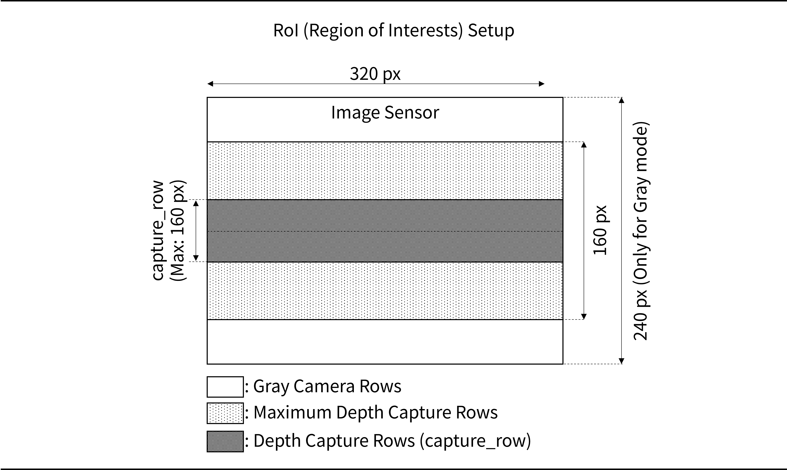

#### 7-1-2. Binning
- The iTFS sensor provides a binning feature to combine signals from neighboring pixels, reducing resolution while increasing signal strength. Three binning modes are available based on the **capture_mode**:
  - **NB**(No Binning): Measures without combining neighboring pixels, retaining full resolution.
  - **VB**(Vertical Binning): Combines signals from two vertically adjacent pixels for measurement.
  - **HV**(Horizontal and Vertical Binning): Combines signals from four horizontally and vertically adjacent pixels for measurement.

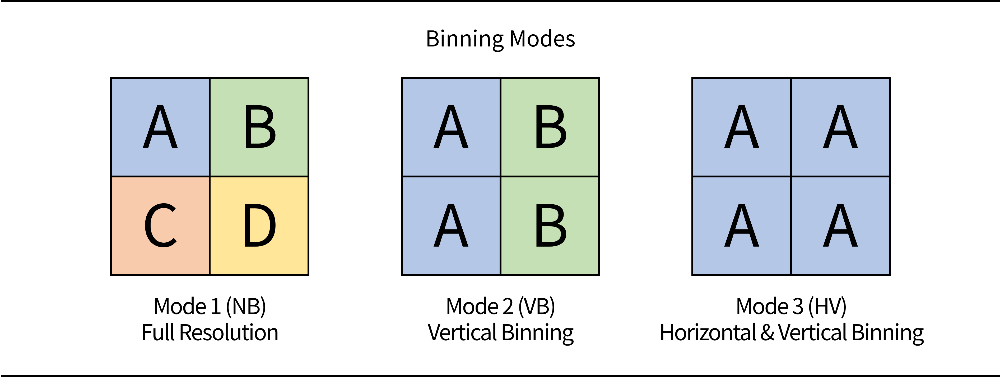

### 7-1-3. Accumulating Image Packets
- The total size of an image captured by the sensor exceeds the **Maximum Transmission Unit (MTU)** of Ethernet, which is 1500 bytes. To ensure stable transmission, the depth and intensity images are split into several rows and sent to the user via **IMG packets**. The user must extract image information from the **IMG packet** and stack it based on the **row_index** to reconstruct the raw depth and intensity images.

| Mode | Total Pixels  | Rows per IMG Packet | Depth row_index | Intensity row_index |
| :--: | :-----------: | :-----------------: | :-------------: | :-----------------: |
|  NB  | 320 x 160 x 2 |          2          |      0~79       |       80~159        |
|  VB  | 320 x 80 x 2  |          2          |      0~39       |        40~79        |
|  HV  | 160 x 80 x 2  |          4          |      0~19       |        20~39        |

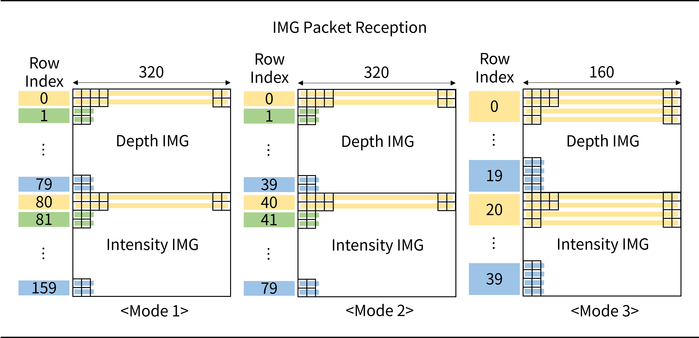

- In the cases of **VB** and **HV**, the image resolution differs from that of **NB**. To obtain images with consistent resolution across all modes, restore the resolution as follows:

  - **VB**: Duplicate each pixel value once in the vertical direction to restore the resolution.
  - **HV**: Duplicate each pixel value once in both the horizontal and vertical directions to restore the resolution.

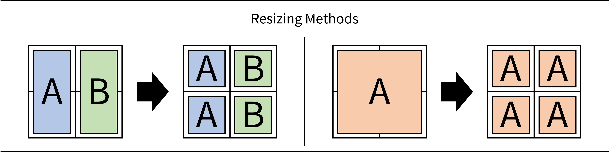

## 7-2. Point Cloud
- This section explains how to reconstruct a point cloud from image data.
- To obtain a point cloud using the iTFS sensor, follow these steps for coordinate transformations:
1. **Transform from Image Coordinates to Lidar Local Coordinates**: Convert the 2D pixel coordinates and depth values obtained from the image to the 3D coordinates in the local coordinate system of the lidar.
2. **Transform from Lidar Local Coordinates to World Coordinates**: Use the sensor's pose and orientation information to transform the local 3D coordinates into the global (world) coordinate system.
- These transformations ensure that the point cloud data is spatially consistent and can be integrated with other data in the world coordinate system.

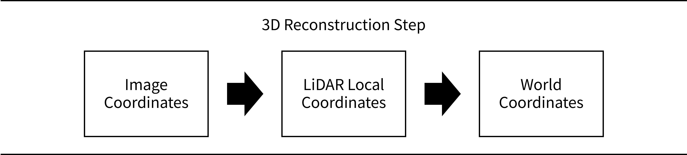

### 7-2-1. Image Coordiantes to LiDAR Local Coordinates
- To convert from image coordinates to the 3D local coordinates of the lidar, depth and intensity image data along with the camera intrinsic data file (provided in `.dat` format for iTFS sensors) are required.

1. **Extract Data from Image Coordinates**:
   - In the image coordinate system \((U,V)\):
     - The depth value is \(d = I(u,v)\).
     - The intensity value is \(i = I(u,v+160)\).

2. **Obtain 3D Direction Vectors**:
   - The intrinsic data file defines per-pixel 3D direction vectors \(V(u,v)\):
     \[
     V(u,v) = (V_x, V_y, V_z)[v][u] = \text{vec}[v][u][3]
     \]
   - For \(V_{\{x,y,z\}}\), adjust the vertical index to account for the difference in row counts between the image and intrinsic data:
     \[
     V_{\{x,y,z\}} = \text{vec}[v + \frac{240-160}{2}][u][\{0,1,2\}]
     \]

3. **Compute 3D Coordinates**:
   - Using the depth \(d(u,v)\) and the direction vector \(V(u,v)\), calculate the local 3D point coordinates \(p(x,y,z)\):
     \[
     p(x,y,z) = d(u,v) \times V(u,v) = (d \times V_x, d \times V_y, d \times V_z)
     \]

- This computation generates the 3D coordinates of each pixel in the lidar's local coordinate system.

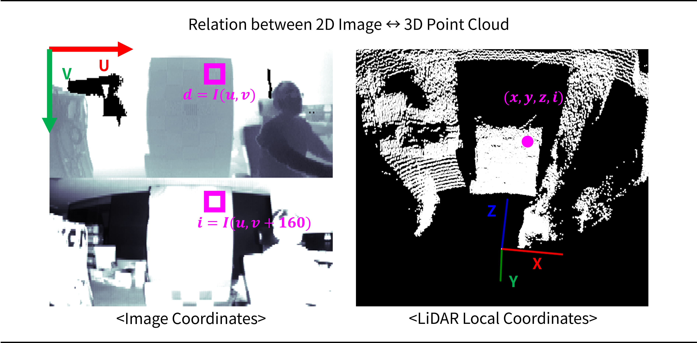 

### 7-2-2. LiDAR Local Coordinates to World Coordinates
- To convert from the lidar's local coordinate system to the world coordinate system, the following information is required:

1. **Inputs**:
   - **Local point cloud coordinates**: Each point in the lidar's local coordinate system, \(p(x, y, z)\).
   - **Rotation matrix aligning local axes to world axes**: \(R_o\), which aligns the local \(X, Y\) axes with the world coordinate system.
   - **World coordinate system pose of the lidar**: The 6 degrees of freedom (6-DoF) position and orientation of the lidar, expressed as \(R|T\), where:
     - \(R\): Rotation matrix representing the lidar's orientation in the world coordinate system.
     - \(T\): Translation vector representing the lidar's position in the world coordinate system.

2. **Transformation to World Coordinates**:
   - Using the above data, the world coordinates of each point in the point cloud, \(p_{\text{world}}\), can be calculated as:
     \[
     p_{\text{world}} = R \times R_o \times p + T
     \]

   - **Explanation**:
     - \(R_o \times p\): Aligns the local point \(p\) to the intermediate coordinate system.
     - \(R \times (R_o \times p)\): Rotates the aligned point to the world orientation.
     - \(+ T\): Translates the point to its final position in the world coordinate system.

- This process transforms the lidar's local point cloud into a globally meaningful spatial representation in the world coordinate system.

# 8. Software Examples
- The **ilidar-api-cpp** examples provide guidance on how to control and retrieve data from iTFS sensors using the C/C++ programming language. For more detailed explanations about these examples, please visit the [official GitHub page for ilidar-api-cpp](https://github.com/ilidar-tof/ilidar-api-cpp).

# 9. Configuration
## 9-1. Configuration Process
- Configuring and modifying sensor parameters is done through **CMD** and **INFO** (or **INFO_V2**, hereafter referred to as **INFO**) packets. For detailed descriptions of each packet, refer to previous sections.
- The following flowchart illustrates the process of changing the sensor configuration:

1. **Send the **CMD_READ_INFO** packet to the sensor.**  
   If the iTFS sensor receives the **CMD_READ_INFO** packet successfully, it will respond with an **INFO** packet containing its configuration. If the user does not receive the **INFO** packet, check the hardware and IP-related settings.  
   - Inspect the **lock** field in the **INFO** packet. If a configuration lock is active, send a **CMD_UNLOCK** packet to enable configuration changes.

2. **Prepare and send a new **INFO** packet with updated configurations.**  
   The sensor overwrites its settings with the values provided in the **INFO** packet. To avoid unintended changes, **copy the existing **INFO** packet and modify only the values that need to be updated** before sending it to the sensor.  
   After receiving the **INFO** packet, the sensor processes it as follows:  
   - Validates each value in the **INFO** packet and replaces any invalid values with defaults.  
   - Applies the updated configuration.  
   - Sends back an **INFO** packet with the updated settings for user verification.  

3. **The sensor operates based on the updated settings.**  
   Note: Configuration changes for IP-related parameters are applied only after a reboot.  
   - If you need to persist the configuration across reboots, send a **CMD_STORE** packet. The sensor saves the current settings to its FLASH memory, which will be loaded during the next boot.  
   - To revert to previous settings if incorrect configurations are applied, avoid sending the **CMD_STORE** packet and perform a reboot instead.

4. **Send a **CMD_REBOOT** packet to reboot the sensor.**  
   After the reboot, send another **CMD_READ_INFO** packet and verify the returned **INFO** packet to confirm that the settings were successfully saved and applied.

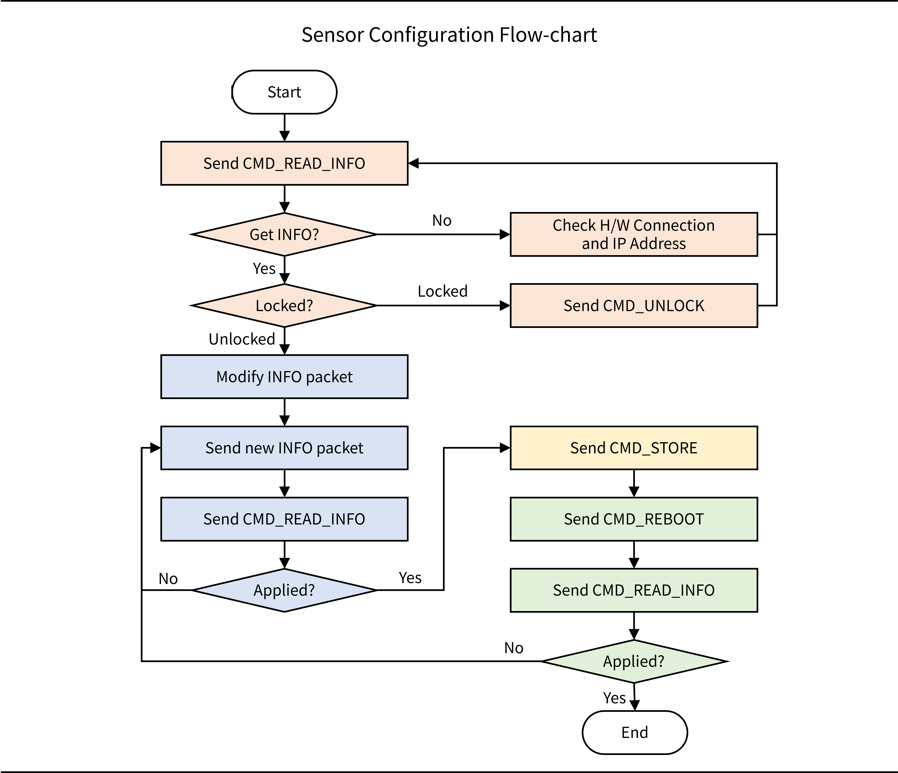

## 9-2. HDR Configuration
- The iTFS sensor includes an HDR (High-Dynamic Range) feature to ensure stable depth image acquisition.
- The HDR feature is automatically activated based on the **capture_shutter** = [SH1, SH2, SH3, SH4, G] settings:
  - **SH1,...,SH4**: Shutter lengths for depth image acquisition. HDR is automatically activated when two or more SH values are assigned non-zero values.
  - **G**: Shutter length for grayscale camera mode; it does not affect depth image acquisition.
- HDR stages are determined by the **capture_shutter** settings as follows: 

| mode  | SH1 | SH2 | SH3 | SH4 | HDR Level |
| :---: | :-: | :-: | :-: | :-: | :-------: |
|  2,3  |  >0  |  >0  |  >0  |  >0  |     4     |
|   1   |  >0  |  >0  |  >0  |  >0  |     3     |
| 1,2,3 |  >0  |  >0  |  >0  |  0  |     3     |
| 1,2,3 |  >0  |  >0  |  0  |  0  |     2     |
| 1,2,3 |  >0  |  0  |  0  |  0  |     1     |

- To ensure proper HDR depth image acquisition, configure the settings such that **SH1 > SH2 > SH3 > SH4**.

# 10. Synchronization
- The iTFS sensor operates as a flash-based LiDAR, where it illuminates the entire Region of Interest (RoI) at once, much like a flashlight, and simultaneously receives the reflected light from the entire RoI. Consequently, interference may occur when multiple sensors using the same wavelength operate in proximity. (The iLidar-ToF: iTFS series uses a wavelength of 940nm.)
- When multiple iTFS sensors are used in the same location, interference can be avoided using the TDMA (Time Division Multiple Access) method, which separates the capturing times of each sensor. This chapter explains the synchronization methods to achieve this.

## 10-1. Multi-sensor Synchronization
- The iTFS sensor performs capturing at different times depending on the mode and HDR stages. For example, when a sensor is set to Mode 1 with 3-stage HDR, it performs measurements 4 times per HDR stage, for a total of 12 measurements. The measurement time windows (the time during which light is emitted and received) are as shown in the diagram below.
- When operating multiple sensors with the same Mode 1 / 3-stage HDR configuration in the same area, interference can be avoided by temporally arranging the data acquisition times of individual LiDARs so they do not overlap. The diagram below illustrates this concept, with each color representing a different iTFS sensor.

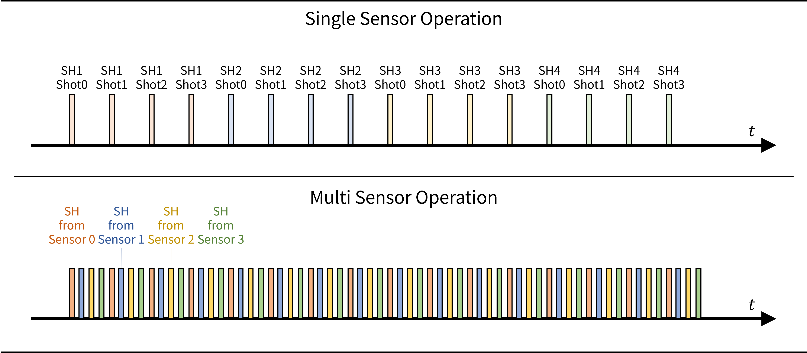

- To achieve this, all sensors must share a common reference point (synchronization), and the time windows for individual sensors must be configured so that they do not overlap. The following sections will explain this process in detail.

## 10-2. Synchronization Methods
- For synchronization, all sensors must share the same reference time. The method of synchronization depends on the value of **sync_mode** in the **INFO** configuration.

|  Type   | sync_mode | Description                      |
| :-----: | :-------: | :------------------------------- |
|  None   |     0     | No synchronization               |
|   UDP   |     1     | Synchronizatino with UDP         |
| Trigger |     2     | Synchronization with Trigger pin |

### 10-2-1. UDP Synchronization
- UDP-based synchronization uses the receipt time of the **CMD_SYNC** packet via UDP as the reference time for synchronization. Typically, the user broadcasts the **CMD_SYNC** packet to all sensors.
- Synchronization remains functional as long as the delay caused by network latency for receiving the **CMD_SYNC** packet by individual sensors is within 3–4 us.
- Sensor settings for UDP-based synchronization are as follows:
  - **sync_mode**: 1
  - **sync_trig_delay_us**: Integer value between 0 and **capture_period_us**, in units of us.
- The operational steps are:
  1. The time at which the sensor receives the **CMD_SYNC** packet is set as the reference time.
  2. Data acquisition starts after a delay of (**sync_trig_delay_us** - **sync_trig_trim_us**) us from the reference time and repeats every **capture_period_us**.
  3. Over time, the reference time among sensors may drift. Therefore, the user periodically broadcasts the **CMD_SYNC** packet to maintain synchronization.

### 10-2-2. Trigger Synchronization
- Wired synchronization uses the signal received through the sensor's **TRIGGER** pin as the reference time. The user must provide synchronization signals simultaneously to all sensors in use.
- Sensor settings for wired synchronization are as follows:
  - **sync_mode**: 2
  - **sync_trig_delay_us**: Integer value between 0 and **capture_period_us**, in units of us.
- The operational steps are:
  1. The time at which the signal is received via the **TRIGGER** pin is set as the reference time.
  2. Data acquisition starts after a delay of (**sync_trig_delay_us** - **sync_trig_trim_us**) us from the reference time and repeats every **capture_period_us**.
  3. Over time, the reference time among sensors may drift. To maintain synchronization, periodic signals must be provided via the **TRIGGER** pin.

### 10-2-3. Optical Synchronization (In Development)
- Optical synchronization avoids the need for wired synchronization. Individual sensors analyze light emitted by other sensors to achieve synchronization. This feature is currently under development.

## 10-3. Fine-Tuning Time Window
- To avoid interference between sensors, individual measurement time windows of each sensor can be finely adjusted.

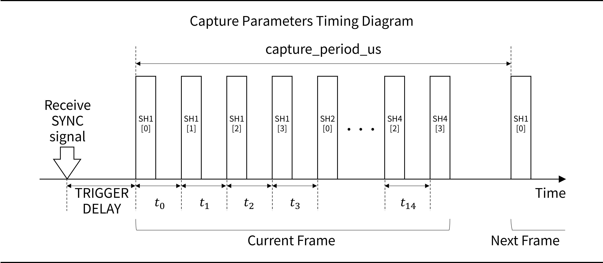

- When the synchronization function is activated, the sensor starts data acquisition after a **trigger delay** from the time it receives the synchronization signal. The **trigger delay** can be set as follows:
  - **sync_trig_delay_us**: Configured delay value.
  - **sync_ill_trim_us**: Compensation for communication latency.
> $$ \textit{Trigger delay} = (\textit{sync\\_trig\\_delay\\_us}) - (\textit{sync\\_trig\\_trim\\_us}) $$
- The sensor captures four raw images for each HDR step. When set to the maximum 4-step HDR, it captures 16 raw images to calculate depth and intensity images. The time interval between raw images in the same frame is denoted as $t_i(i=0 \sim 14)$. Adjusting these intervals can be achieved by setting a non-zero value for **sync_ill_delay_us[i]**. If the configured value is shorter than the **Minimum delay**, the sensor will use the **Minimum delay** instead.
  - **Minimum delay** (minimum processing time):
    - Mode 1: **capture_shutter** + 3900 [us]
    - Mode 2: **capture_shutter** + 1950 [us]
    - Mode 3: **capture_shutter** + 975 [us]
  - **sync_ill_delay_us** [i]: Configured delay value, applied individually for each (i).
  - **sync_ill_trim_us**: Internal clock error compensation value, applied uniformly across all (i).
> $$ t_{i}= \text{MAX} (\textit{Minimum delay},\textit{sync\\_ill\\_delay\\_us[i]} - \textit{sync\\_ill\\_trim\\_us}) $$

- This fine-tuning ensures that each sensor's measurement window is optimized to avoid overlap, minimizing interference while maintaining precise synchronization.

## 10-4. Multi Sensor Examples
- The following describes how to use four iTFS sensors simultaneously through the UDP synchronization method. For stable synchronization, ensure the following:
  - The **capture_mode** of each sensor is set identically.
  - The **capture_period** is configured equally for all sensors.
  - The **sync_mode** is consistent across all sensors.
  - The **sync_delay** values for each sensor are configured to avoid overlapping illumination profiles.
- First, configure all sensors with the following parameters:

| Common Parameters |       Value        |
| :---------------: | :----------------: |
|   capture_mode    |         1          |
|  capture_period   |         80         |
|  capture_shutter  | [400,80,16,0,8000] |
|       sync        |         1          |

- Next, set the **sync_delay** for each sensors:

| Sensors | sync_delay |
| :---------------: | :--------: |
|      iTFS_A       |     0      |
|      iTFS_B       |     20     |
|      iTFS_C       |     40     |
|      iTFS_D       |     60     |

- Connect the PC and the iTFS sensors as shown in the diagram below, and configure the PC to periodically broadcast the **CMD_SYNC** packet (approximately once every 2–3 minutes).

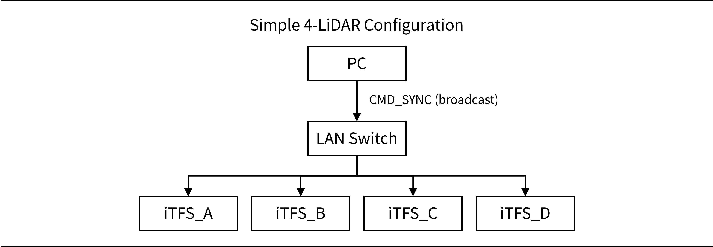

# 11. Sensor Maintenance Guide
## 11-1. Hardware Maintenance and Safety Guide
### 11-1-1. Electrical Requirements and Safety Conditions
- Ensure that the electrical connection points of the wires connected to the product are always securely in contact. Loose connections may result in malfunctions, poor signal quality, or fire hazards.  
- This product does not support waterproofing. Prevent water, conductive liquids, flammable powders and liquids, or any other liquids from coming into contact with the sensor. Particularly, ensure that no liquids touch the electrical connection points of the sensor.  
- High humidity can cause condensation inside the product, leading to electrical damage.  
- Avoid direct contact with the electrical connection points by human bodies or conductive objects, even when the product is not powered.  
- Use only certified devices for power supply and signal transmission to ensure performance and safety.  
- Check the permissible voltage range for the power supply method used with the product before connecting it. Unstable power supply or operating outside the permissible voltage range can cause permanent damage to the product.  
- To ensure stable operation, monitor the following values in the **STATUS** packet. If any value exceeds the permissible range, immediately stop using the product and verify the power supply method:

|     Parameters     |     Description      | Minimum | Maximum |
| :----------------: | :------------------: | :-----: | :-----: |
| sensor_vcsel_level | Laser Voltage Level  | 11.00 V | 11.65 V |
| sensor_power_level | Internal Power Level | 17.5 V  | 21.5 V  |
  - **sensor_power_level**: Internal power voltage  

- Failure to adhere to these electrical and safety requirements may result in reduced performance, malfunctions, or permanent damage to the product.

### 11-1-2. Temperature and Heat Dissipation
- Ensure that the product and the devices supplying power to it are not damaged or overheated.  
- During operation, the sensor surface temperature may rise above the typical ambient temperature (25°C). To avoid burns, refrain from direct skin contact with the product surface or lingering near the product. Always check the product's surface temperature before touching it.  
- For optimal operation, ensure there is sufficient space around the heat sink on the product's rear side to allow free airflow.  
- To maintain proper functionality, users may need to implement additional heat dissipation measures such as ventilation systems or cooling fans.  
- For safe operation, monitor the following parameters from the **STATUS** and **STATUS_FULL** packets. If any of the values exceed permissible limits, immediately stop using the product:

|    Parameters    |          Description           | Minimum | Maximum |
| :--------------: | :----------------------------: | :-----: | :-----: |
|  sensor_temp_rx  | Receiver Temperature (Celsius) | -25 °C  |  90 °C  |
| sensor_temp_core | Circuit Temperature (Celsius)  | -25 °C  | 100 °C  |
|   sensor_temp    |   Case Temperature (Celsius)   | -25 °C  |  70 °C  |

- Failure to maintain appropriate temperature control and heat dissipation could result in performance degradation, safety risks, or permanent damage to the product.

### 11-1-3. Optical Windows
- If the optical window is damaged, there is a risk of injury. Immediately stop using the product in such cases.  
- Routine maintenance of the product primarily involves cleaning dust and smudges from the optical windows. Dust and smudges can negatively affect the product's performance, particularly measurement accuracy. In environments prone to excessive dust or smudges, periodically inspect the optical windows and clean them using the methods outlined below:  
  - **Dust Removal**: If dust is present on the optical window, avoid wiping it directly as this may cause damage to the surface. Instead, use compressed air to remove the dust from the optical window.  
  - **Smudge Removal**: Use optical lens tissues specifically designed for cleaning optical devices to remove smudges. If dust is also present, first use compressed air to remove the dust, and then proceed to clean the smudges.  
- Regular maintenance ensures the product continues to operate accurately and safely, especially in challenging environments.

## 11-2. Warning Code
- The last 4 bytes of the **sensor_warning** field in the STATUS packet's PAYLOAD contain warning codes indicating issues detected during the sensor's operation. Users should monitor this value and respond appropriately when warnings occur.
- **Voltage-Related Issues**: Verify that the power supply to the sensor is stable and within the recommended range. Inspect connections to ensure proper contact and eliminate loose or faulty wiring.  
- **Temperature-Related Issues**: Ensure proper airflow around the sensor to maintain optimal operating conditions. Introduce additional cooling solutions, such as heat sinks or cooling fans, if necessary.  
- **Persistent Issues**: If the problem continues despite corrective actions, contact the product manufacturer for further assistance.
- Regularly check the **sensor_warning** field in STATUS packets to preemptively address potential issues and maintain sensor performance and longevity.

| Bit | Description              | Bit | Description       |
| :-: | :----------------------- | :-: | :---------------- |
|  2  | Reserver Overvoltage     | 14  | 5V Overvoltage    |
|  3  | Reserver Undervoltage    | 15  | 5V Undervoltage   |
|  4  | Transmitter Overvoltage  | 16  | 10V Overvoltage   |
|  5  | Transmitter Undervoltage | 17  | 10V Undervoltage  |
|  6  | REF Overvoltage          | 18  | -10V Overvoltage  |
|  7  | REF Undervoltage         | 19  | -10V Undervoltage |
|  8  | BAT Overvoltage          | 20  | Receiver Overheat |
|  9  | BAT Undervoltage         | 21  | Receiver Freezing |
| 10  | Input Overvoltage        | 22  | MCU Overheat      |
| 11  | Input Undervoltage       | 23  | MCU Freezing      |
| 12  | 1.8V Overvoltage         | 24  | Case Overheat     |
| 13  | 1.8V Undervoltage        | 25  | Case Freezing     |

## 11-3. Factory Reset
- If the sensor's network settings are unintentionally configured, making data access difficult, you can reset the sensor's internal parameters to factory defaults using the following methods:

### For iTFS Series Firmware **V 1.4.X**:
> 1. Use a network tool such as **Wireshark** to identify the sensor's IP address.
> 2. Send a **CMD_RESET** packet to the identified IP address to perform the factory reset.

### For iTFS Series Firmware **V 1.5.X or Later**:
- You can reset the sensor using the **CMD_RESET** packet as described for **V 1.4.X** firmware.
- Additionally, **V 1.5.X or later** firmware provides a physical factory reset method:
- **(Warnings)** Ensure proper electrical connections when performing the physical factory reset to avoid damage.
- **(Warnings)** Damage caused by incorrect I/O port connections is not covered under the free A/S (After-Sales Service) policy.
> 1. Completely disconnect the sensor's power supply.
> 2. Connect the **TRIGGER** and **STROBE** pins on the sensor's 6-pin I/O port at the rear of the device.
> 3. While maintaining the connection from Step 2, supply power to the sensor.
> 4. Once powered, observe the LINK/ACT LED on the LAN port blinking at a consistent interval.
> 5. When the blinking is confirmed, completely disconnect the power supply.
> 6. Remove the connection between the **TRIGGER** and **STROBE** pins on the 6-pin I/O port.
> 7. Reapply power to the sensor. The sensor will initialize with factory default parameter values.

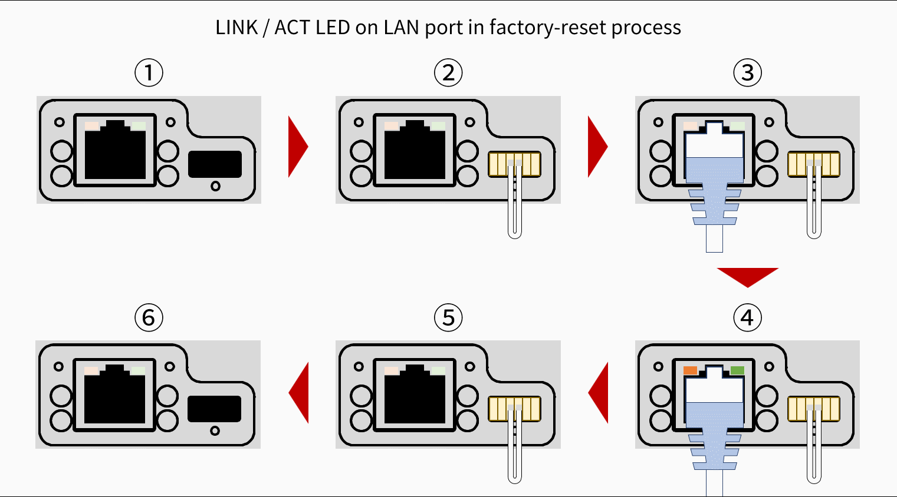

# 12. FAQ
## Q1. The product is connected to the PC, but no data is being received.
Please check the following:
### 1. Check if the LiDAR is operating properly:
- If the LiDAR is functioning and transmitting data normally, the LINK/ACT LEDs on the rear LAN port should indicate activity:
  - **LINK = BLINK** / **ACT = ON**.
- Verify the LINK/ACT LED status:
  - If the LINK/ACT LEDs are not functioning correctly, check the power supply to ensure it is stable.
  - If the power supply is stable but the LINK/ACT LEDs are still inactive, please contact the A/S center.
  - If the LINK/ACT LEDs are working correctly, proceed to step 2.

### 2. Check if LiDAR data is being received:
- To verify whether data packets are being received, we recommend using **Wireshark** (downloadable at [Wireshark](https://www.wireshark.org/)).
- Use the program to confirm that the **Source/Destination IP** is correctly configured and packets are being received.
- If issues are detected in Wireshark:
  - Set the receiving PC's IP address to the default settings and verify the connection (a reboot may be required to apply network changes).
  - **Default Dest IP**: 192.168.5.2  
  - **Default Subnet Mask**: 255.255.255.0  
- If no issues are detected in Wireshark, proceed to step 3.

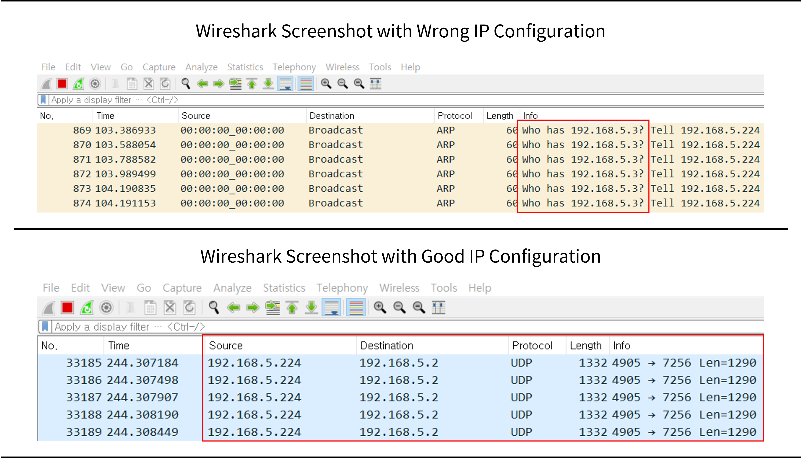

### 3. Check the firewall settings:
- The LiDAR uses the receiving PC's sockets on ports **7256/7257** (default).
- Check whether the firewall on Windows or another OS is blocking these sockets.
- If a firewall is active:
  - Disable the firewall and test whether data can now be received.
- If disabling the firewall does not resolve the issue, please contact the A/S center.
