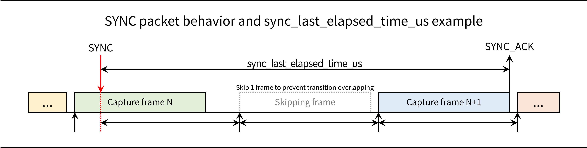

# HYBO | iLidar-ToF | iTFS Series User Manual (KR)
V 1.1.4 (21- Nov.-2024)

# INDEX
- [INDEX](#index)
- [1. Important Information](#1-important-information)
  - [1-1. Notification](#1-1-notification)
  - [1-2. Warnings](#1-2-warnings)
  - [1-3. Legal Notices](#1-3-legal-notices)
    - [1-3-1. Laser Safety](#1-3-1-laser-safety)
    - [1-3-2. Hot Surface Warning](#1-3-2-hot-surface-warning)
  - [1-4. Certifications](#1-4-certifications)
    - [1-4-1. KC](#1-4-1-kc)
    - [1-4-2. CE](#1-4-2-ce)
    - [1-4-3. IEC 60825-1:2014](#1-4-3-iec-60825-12014)
- [2. Sensor Overview](#2-sensor-overview)
  - [2-1. iLidar-ToF](#2-1-ilidar-tof)
  - [2-2. Fundamentals of Indirect Time-of-Flight Sensors](#2-2-fundamentals-of-indirect-time-of-flight-sensors)
  - [2-3. Known Limitations](#2-3-known-limitations)
    - [2-3-1. Multi-Path Error](#2-3-1-multi-path-error)
    - [2-3-2. Scattering](#2-3-2-scattering)
  - [2-4. Specifications](#2-4-specifications)
    - [2-4-1. Differences by model](#2-4-1-differences-by-model)
    - [2-4-2. Commonalities](#2-4-2-commonalities)
- [3. Mechanical Parts](#3-mechanical-parts)
  - [3-1. What's in the box?](#3-1-whats-in-the-box)
  - [3-2. Mechanical Drawing](#3-2-mechanical-drawing)
  - [3-3. Installation Guidelines](#3-3-installation-guidelines)
- [4. Electrical Connection](#4-electrical-connection)
  - [4-1. Pinout](#4-1-pinout)
  - [4-2. Power](#4-2-power)
    - [4-2-1. Connection Example with PoE](#4-2-1-connection-example-with-poe)
    - [4-2-2. Connection Example with 12VDC](#4-2-2-connection-example-with-12vdc)
- [5. Sensor Operation](#5-sensor-operation)
  - [5-1. Network Configuration](#5-1-network-configuration)
    - [5-1-1. Windows](#5-1-1-windows)
    - [5-1-2. Linux(Ubuntu)](#5-1-2-linuxubuntu)
  - [5-2. iViewer:Simple iLidar Data Viewer](#5-2-iviewersimple-ilidar-data-viewer)
- [6. Packets and Parameters](#6-packets-and-parameters)
  - [6-1. Basic Packet Structure](#6-1-basic-packet-structure)
  - [6-2. List of ID](#6-2-list-of-id)
  - [6-3. IMG Packet](#6-3-img-packet)
  - [6-4. STATUS Packet](#6-4-status-packet)
  - [6-5. STATUS\_FULL Packet](#6-5-status_full-packet)
  - [6-6. INFO Packet](#6-6-info-packet)
  - [6-7. INFO\_V2 Packet](#6-7-info_v2-packet)
  - [6-8. CMD Packet](#6-8-cmd-packet)
  - [6-9. SYNC\_ACK Packet](#6-9-sync_ack-packet)
- [7. How to Handle Image and Point Cloud](#7-how-to-handle-image-and-point-cloud)
  - [7-1. Image Data](#7-1-image-data)
    - [7-1-1. Capture Row](#7-1-1-capture-row)
    - [7-1-2. Binning](#7-1-2-binning)
    - [7-1-3. Accumulating Image Packet](#7-1-3-accumulating-image-packet)
  - [7-2. Point Cloud](#7-2-point-cloud)
    - [7-2-1. Image Coordiantes to LiDAR Local Coordinates](#7-2-1-image-coordiantes-to-lidar-local-coordinates)
    - [7-2-2. LiDAR Local Coordinates to World Coordinates](#7-2-2-lidar-local-coordinates-to-world-coordinates)
- [8. Software Examples](#8-software-examples)
- [9. Configuration](#9-configuration)
  - [9-1. Configuration Process](#9-1-configuration-process)
  - [9-2. HDR Configuration](#9-2-hdr-configuration)
- [10. Synchronization](#10-synchronization)
  - [10-1. Multi-sensor Synchronization](#10-1-multi-sensor-synchronization)
  - [10-2. Synchronization Methods](#10-2-synchronization-methods)
    - [10-2-1. UDP Synchronization](#10-2-1-udp-synchronization)
    - [10-2-2. Trigger Synchronization](#10-2-2-trigger-synchronization)
    - [10-2-3. Optical Synchronization (in development)](#10-2-3-optical-synchronization-in-development)
  - [10-3. Fine-Tuning Time Window](#10-3-fine-tuning-time-window)
  - [10-4. Multi Sensor Examples](#10-4-multi-sensor-examples)
- [11. Sensor Maintenance Guide](#11-sensor-maintenance-guide)
  - [11-1. Hardware Maintenance and Safety Guide](#11-1-hardware-maintenance-and-safety-guide)
    - [11-1-1. Electrical Requirements and Safety Conditions](#11-1-1-electrical-requirements-and-safety-conditions)
    - [11-1-2. Temperature and Heat Dissipation](#11-1-2-temperature-and-heat-dissipation)
    - [11-1-3. Optical Windows](#11-1-3-optical-windows)
  - [11-2. Warning Code](#11-2-warning-code)
  - [11-3. Factory Reset](#11-3-factory-reset)
- [12. FAQ](#12-faq)

# 1. Important Information
## 1-1. Notification
- 제품을 사용하는 것은 본 문서에 명시된 안내 및 주의사항을 이해하고 준수하는 것에 동의한 것으로 간주됩니다. 
- 제품 사용 전, 반드시 안전규정과 작동 방법을 숙지하시기 바랍니다. 부적절한 제품의 사용은 제품에 문제를 일으킬 수 있으며, 오동작을 야기하여 상처를 입히거나 재산 피해를 발생시킬 수 있습니다. 따라서 처음 제품을 사용하기 전에 제품과 관련된 자료(퀵 스타트 가이드, 사용자 매뉴얼)를 반드시 숙지하십시오. 
- 제품, 제품 액세서리 및 모든 자료를 사용하거나 이에 접근하여 발생할 수 있는 모든 손해 위험은 사용자가 부담합니다. 주식회사 하이보는 본 제품의 사용으로 인한 직/간접적으로 발생한 인적/물적 피해 혹은 법적 분쟁에 대한 어떠한 책임도 지지 않습니다. 따라서 사용자는 본 제품을 자신의 의지로 사용하고, 제품의 사용 또는 사용 불가로 인해 발생하는 인적/물적 피해 혹은 제3자의 인적/물적 피해에 대해 책임이 있음을 이해하고 이에 동의합니다. 미연의 사고를 방지하기 위해, 사용자는 제품 관련 자료를 포함하여 안전하고 적법한 사용 방법을 준수해야만 합니다.

## 1-2. Warnings
- 제품 사용 전, 반드시 안전규정과 작동 방법을 숙지하시기 바랍니다. 부적절한 사용방법은 장비에 문제를 줄 수 있으며, 오동작을 야기하여 상처를 입거나 재산 피해가 발생할 수 있습니다. 따라서 처음 제품을 사용하기 전에 제품과 관련된 자료를 반드시 숙지하십시오.
- 어떠한 방식이든 제품을 분해해서 사용, 개조, 수리하시면 안 됩니다. 특히, 레이저가 출력되는 광학 파트를 불법 개조하거나 변경시키는 것은 심각한 안구 손상을 야기할 수 있으므로 금지되어 있습니다. 만약, 제품의 성능을 다르게 구성해야 한다면, 제품을 개조하지 마시고 주식회사 하이보 본사로 연락하여 제품 커스텀에 대해 상담하시기 바랍니다.
- 광학 윈도우가 파손된 상태에서 가까운 곳에서 제품 바라볼 경우 안구 손상을 일으킬 수 있습니다. 따라서, 제품 사용 전 제품 전면(front)의 광학 윈도우의 상태를 확인하십시오. 광학 윈도우가 파손된 경우에는 제품을 사용하지 마시고, 동작중인 제품은 즉시 전원을 차단하십시오. 불가피하게 광학 윈도우가 파손된 제품에 가까이 가게 될 경우 LASER CLASS 3R을 대비할 수 있는 안구 보호 장비를 착용하십시오.
- 제품 전면의 광학 윈도우가 파손된 경우, 제품을 구동하지 마시고 반드시 주식회사 하이보 A/S 센터로 연락하여 조치를 받으십시오.
- 제품 전면의 광학 윈도우를 손톱, 드라이버 등의 날카로운 물건으로 누르지 마십시오. 광학 윈도우의 찍힘으로 인한 데미지는 측정 데이터 불량 등의 제품 손상을 야기할 수 있습니다. 그리고, 제품 전면의 광학 윈도우에 물방울, 먼지 등의 이물질이 묻은 경우, 부드러운 천으로 닦아내서 청결한 상태를 유지하십시오. 광학 윈도우의 이물질은 측정 데이터 불량을 야기할 수 있습니다.
- 제품 전면의 광학 윈도우를 커버, 스티커 등으로 가리지 마십시오. 측정 데이터 불량을 야기할 수 있습니다. 설치 형식의 제품 사용의 경우 설치 가이드에 명시된 킵-아웃-존을 참고하여 제품을 설치하여 사용하십시오.
- 제품 전면의 광학 윈도우의 표면에는 미세한 굴곡 및 스크래치가 있을 수 있으며, 이는 정상적인 현상입니다.
- 제품을 바닥에 떨어뜨리면 손상에 의한 불량이 발생할 수 있으므로 주의하십시오.
- I/O 커넥터를 통해 12VDC 사용의 경우 올바른 연결을 위해 반드시 핀맵을 확인하십시오. 잘못된 전원 연결은 제품의 고장을 유발할 수 있습니다. 잘못된 연결로 야기된 고장은 보증 서비스가 적용되지 않습니다.
- 주식회사 하이보에서 승인한 케이블 규격을 사용하십시오. 그렇지 않을 경우 제품 고장을 야기할 수 있습니다.
- 사용하는 케이블 및 커넥터가 젖은 상태에서 연결될 경우 제품이 손상될 수 있습니다.
- 제품 동작 시 광원 구동에 따른 발열이 나타납니다. 일반적인 실내 환경 기준, 제품 후면의 온도가 약 60 ℃ 이상으로 올라갈 수 있으며, 이는 정상적인 현상입니다. 제품 후면의 온도가 과도하게 올라가는 경우, 후면 마운트 홀을 활용하여 열전도가 가능한 금속 판 등에 부착하여 열을 배출하시기 바랍니다.

## 1-3. Legal Notices
### 1-3-1. Laser Safety
- iTFS 시리즈는 940 nm 파장의 적외선 비가시광 레이저 광원을 사용하는 제품입니다. 이에 따른 국제 규격인 IEC 60825-1에 준하는 대한민국 표준인 KS C IEC 60825-1:2014에서 규정한 레이저 제품의 안정성 등급 분류 중, CLASS 1 등급에 해당하는 제품입니다.

- CLASS1 등급은 안구에 안전한 것으로 분류되는 등급이지만, 장시간 직접적으로 전면의 광학 윈도우(발광부)를 보는 것을 피하고, 다른 광학 장비를 사용해서 전면의 광학 윈도우(발광부)를 주시하지 마십시오. 
- 제품의 전면 광학 윈도우가 분리될 시 CLASS 3R 등급에 해당하는 수준의 광노출이 발생할 수 있습니다. 따라서, 주의 표시를 명심하고, 광학 윈도우 및 전면 커버를 절대 분해해서 사용하지 마십시오. 

### 1-3-2. Hot Surface Warning
- iTFS 시리즈는 광원 구동으로 인해 제품 동작 시 발열이 나타납니다. 제품 후면의 온도가 약 60 ℃(@ Room temperature)까지 올라갈 수 있으며, 이는 정상적인 현상입니다. 제품 후면의 온도가 과도하게 올라가는 경우, 제품을 직접적으로 손으로 만지면 저온 화상의 위험이 있습니다. 따라서, 제품의 온도를 측정하여 적정 상태로 유지하고, 필요 시 후면 마운트 홀을 활용하여 열전도가 가능한 금속 판 등에 부착하여 열을 배출하시기 바랍니다.

## 1-4. Certifications
- iTFS 시리즈는 국내외 전자제품에 관한 법적 사항을 준수하고 있으며, 아래와 같은 인증을 획득하였음을 알립니다.

### 1-4-1. KC
- iTFS 시리즈는 국내 방송통신기자재법에 따라 KC 인증을 획득하였습니다. 아래에서 관련 정보를 확인할 수 있습니다.

|   구분   |      적합성 평가 정보       |
| :------: | :-------------------------: |
|   상호   |       주식회사 하이보       |
|  제품명  |         iLidar-ToF          |
|  모델명  |     iTFS-110 / iTFS-80      |
| 인증번호 |      R-R-h2b-iTFS-110       |
| 제조업체 |       주식회사 하이보       |
| 제조국가 |          대한민국           |
| 제조년월 | 0000년 00월(하드 카피 참고) |
| A/S 센터 |         02)597-4905         |

### 1-4-2. CE
- TBD

### 1-4-3. IEC 60825-1:2014
- iTFS 시리즈는 940-nm 대역의 레이저를 사용하는 능동 센서로써, Eye-safety를 위해 IEC 60825-1:2014 표준을 준수하였고, CB Scheme에 따라 국제 인증을 획득하였습니다. 아래에서 관련 정보를 확인할 수 있습니다.

| 구분 | 내용 |
| :--: | :--: |
| Report Number | CB2024-00128 |
| Date of issue | June 28, 2024 |
| Standard | IEC 60825-1:2014 |
| Test procedure | CB Scheme |
| Test item | Lidar |
| Manufacturer | HYBO |
| Model/Type reference | iTFS-110 |
| Ratings | (PoE) DC 48V, 12W(300mA) / (molex) 12VDC, 12W(1A) |
| Class | Class 1 laser product |

# 2. Sensor Overview
## 2-1. iLidar-ToF
- iLidar ToF: iTFS는 3D 고정형 라이다(3D Solid-state Lidar)로, 시중의 기존 라이다 센서에 비해 비용 효율적인 솔루션을 제공합니다. 움직이는 부품이 없는 솔리드 스테이트 설계와 고효율 광학 시스템으로 최대 20 m의 측정 범위를 달성할 수 있는 것이 특징입니다.
- iTFS 시리즈는 모바일 로봇의 장애물 회피와 산업 환경의 위험 구역에서 사람의 존재를 모니터링하는 데 사용할 수 있습니다. 또한 주차장에서 차량 출입을 감지하는 등 다양한 용도로 사용할 수 있습니다.
- iTFS 시리즈의 주요 장점 중 하나는 광학 부품의 모듈화입니다. 광학 모듈을 교체하면 센서의 폼 팩터를 유지하면서 다양한 사양을 제공할 수 있습니다. 따라서 사용자는 다양한 환경과 애플리케이션에 맞게 센서의 성능을 조정할 수 있습니다.

## 2-2. Fundamentals of Indirect Time-of-Flight Sensors
- iLidar ToF: iTFS는 indirect ToF (이하 iToF) 방식을 사용하여 거리를 측정합니다. 송신부는 레이저 다이오드로 진폭변조연속파(AMCW) 광을 생성하고, 측정 물체에서 반사된 빛이 센서로 돌아옵니다. 수신부의 ToF 이미지 센서에서는 송신부의 주파수와 동일한 주파수로 빛을 디코딩 합니다. 마지막으로, 송신부와 수신부 사이의 변조 위상차(Δ𝜃)를 계산하고, 다음과 같이 거리를 계산합니다:
> $$d = \frac{c}{2} \cdot \frac{\Delta \theta}{2 \pi f}$$
- $f$ 는 AMCW 주파수, $c$ 는 광속, $d$ 는 물체와의 거리를 의미합니다.

## 2-3. Known Limitations
- iLidar ToF: iTFS 센서가 거리측정에 사용하는 iToF 방식에는 다음과 같은 알려진 한계점이 있습니다. iTFS 센서의 사용에 있어 거리측정 오차를 발생시키는 아래 요인을 숙지하고 사용하여 주시기 바랍니다.

### 2-3-1. Multi-Path Error
- iToF 방식의 거리 측정에 있어 알려진 한계 중 하나는 다중 경로 오차 (Multi-path error) 가 있습니다. 아래 그림과 같이 발광부에서 물체에 반사되어 돌아오는 빛 중 물체에 1번 반사가 일어나 돌아오는 광경로와 2번 반사가 일어나 돌아오는 광경로가 존재하는 경우, ToF 이미지 센서에서 측정하는 거리값이 실제 해당 방향으로의 거리 보다 커지는 문제가 발생할 수 있습니다.
- 또한, 센서 앞에 유리 등의 투명한 물체를 통해 물체를 볼 경우, 유리를 통과한 광경로와 물체를 통과한 광경로의 영향이 합쳐져, 해당 방향의 깊이 값이 유리와 물체 사이로 측정되는 문제가 발생할 수 있습니다.

### 2-3-2. Scattering
- 스캐터링 현상은 iToF 센서의 수광부 내부에서 빛이 반사되어 발생하는 현상입니다. 일반적으로 iToF 센서의 매우 가까이에 물체가 있거나, 거울과 같이 반사율이 높은 물체가 있는 경우 스캐터링 현상이 발생해 깊이 값에 대한 오차를 발생시킵니다. 특히, 먼 물체의 약한 신호와 가까운 물체의 산란으로 인한 신호가 간섭을 일으켜, 원경 물체의 거리가 실제보다 가까워 보이는 현상이 발생할 수 있습니다. 

## 2-4. Specifications
### 2-4-1. Differences by model
|      Features       |   iTFS-110    |    iTFS-80    |
| :-----------------: | :-----------: | :-----------: |
|   Range (mode 1)    | 0.30 ~  8.0 m | 0.30 ~ 10.0 m |
|   Range (mode 2)    | 0.05 ~ 12.0 m | 0.05 ~ 15.0 m |
|   Range (mode 3)    | 0.05 ~ 16.0 m | 0.05 ~ 20.0 m |
| Resolution (mode 1) |  0.4° × 0.4°  |  0.3° × 0.3°  |
| Resolution (mode 2) |  0.4° × 0.8°  |  0.3° × 0.6°  |
| Resolution (mode 3) |  0.8° × 0.8°  |  0.6° × 0.6°  |
|         FoV         |  110° × 60°   |   80° × 45°   |
- On-the-fly configuration available (mode, framerate, and output data)
- Range: Measured at centered ROI by using 80% diffuse-reflective target
- FoV: Range-guaranteed scope. Working horizontal FoVs are 120° and 90° for iTFS-110 and iTS-80 respectively.

### 2-4-2. Commonalities
|     Features      |                    iTFS-110 & iTFS-80                    |
| :---------------: | :------------------------------------------------------: |
|     Accuracy      |   Error level: ± (3~5 cm + 2% of distance measurement)   |
|     Framerate     | Typ. 12.5 Hz (Up to 20 Hz with heatsink and reduced RoI) |
|    Dimensions     |               115.0 mm × 46.0 mm × 31.5 mm               |
|      Weight       |                         200.0 g                          |
|       Power       |         Avg. 6.0 W / Max. 12.0 W (12VDC or PoE)          |
|     Interface     |                UDP (RJ-45) / UART (Molex)                |
|      Output       |                Depth and Intensity Images                |
|   Certification   | IEC 60825-1:2014, KC(R-R-h2b-iTFS-110), CE(Comming soon) |
| Sunlight Immunity |       ~ 33 klux (80% ranging performance @ mode2)        |
|   Illumination    |                     940-nm IR Laser                      |
|    Eye safety     |           CLASS 1 (based on IEC 60825-1:2014)            |

# 3. Mechanical Parts
## 3-1. What's in the box?

- 패키지 포장의 제품을 구매 시, 위와 같이 3가지 물품과 품질보증서를 함께 제공하고 있습니다.
- **iTFS-110 1 대 (또는 iTFS-80 1 대):** 라이다 본품으로, 제품을 덮고 있는 보호 테이프를 반드시 제거하고 사용하시기 바랍니다.
- **LAN 케이블 1m, 1 개:** 라이다 데이터 수신을 위한 LAN 케이블입니다. iTFS 시리즈는 100 Mbps 이상의 통신 속도를 요구합니다. 따라서, 반드시 CAT.5 이상의 UTP 케이블을 사용하시기 바랍니다. 기본으로 제공되는 LAN 케이블의 경우, CAT.5e UTP 케이블입니다. PoE를 사용하여 라이다 전원 공급 시 추가적인 라인 연결은 필요하지 않습니다.
- **Molex 커넥터 30cm, 1개:** 부가적인 기능 제공 케이블로, PoE를 사용하지 않고 12VDC를 직접 인가할 수 있는 단자에 사용하기 위한 케이블입니다. 또한, Trigger/Strobe 등의 기능을 제공합니다. 기본으로 제공되는 커넥터의 Part number는 Molex 51021-0600이며, 22 AWG이상의 난연전선이 포함된 하프-컷 형태 케이블을 포함합니다. 사용자가 직접 케이블을 구성 시, 해당 정보를 확인하여 호환 여부를 판별하시기 바랍니다.

## 3-2. Mechanical Drawing

- iTFS 시리즈의 제품 크기 및 명칭은 다음과 같습니다. (단위: mm)
1. 광학 윈도우 (발광부)
1. 광학 윈도우 (수광부)
1. 마운트용 나사 홀, M3 4-mm depth
1. 데이터 RJ45 커넥터, PoE 지원
1. I/O 커넥터, Molex pico-blade 6-pos
- 제품의 활용을 위한 [3D CAD 모델(STL)](https://www.ilidar.io/)이 공개되어 있으니 활용하시길 바랍니다.

## 3-3. Installation Guidelines
- iTFS 시리즈를 설치할 때 최대 성능을 발휘하기 위해서, 다음과 같이 모델명에 따른 킵-아웃 존(Keep-out zone)을 유의하여 설치하시기 바랍니다. (단위: mm)

- 제품의 후면에 제품 마운트를 위한 나사 홀(M3, 4-mm depth)을 제공합니다. 아래의 나사 홀 위치를 참고하여 설계에 반영하시기 바랍니다.

# 4. Electrical Connection
## 4-1. Pinout
- iTFS 시리즈는 RJ45 커넥터와 6핀 Molex pico-blade를 가지고 있습니다. RJ45 포트는 전원 공급 (PoE) 및 데이터 전송에 사용됩니다. 6핀 Molex pico-blade는 전원 공급 (12V DC) 및 TRIGGER/STROBE 기능에 사용 됩니다.

- iTFS의 RJ45 포트는 PoE 및 PoE+ 규격을 지원합니다. PoE 기능을 통한 전원 공급 시, 전원 공급 장치가 **IEEE802.3af/at** 표준을 만족하는지 확인해 주시기 바랍니다.
- Molex I/O 핀의 연결 정보는 다음과 같습니다.

| Pin |  Name   | I/O |      Rating / Description      |
| :-: | :-----: | :-: | :----------------------------: |
|  1  |  12VDC  |  I  | 12V (Min. 11.6 V, Max. 12.4 V) |
|  2  |  12VDC  |  I  | 12V (Min. 11.6 V, Max. 12.4 V) |
|  3  | TRIGGER |  I  |  TTL (Typ. 3.3 V, Max. 5.0 V)  |
|  4  | STROBE  |  O  |          TTL (3.3 V)           |
|  5  |   GND   |  I  |              GND               |
|  6  |   GND   |  I  |              GND               |

## 4-2. Power
- iTFS 시리즈는 평균 6 W, 최대 12 W의 전력을 소모하여 동작하며, 사용에 편의성을 위해 전원이 일체화 된 PoE 전원 공급과 12VDC 단자를 통한 직접 전원 공급 방식을 제공합니다. 두가지 방식 중 선호하는 방식으로 제품의 전원 및 LAN 케이블을 연결하여 제품을 구동하시기 바랍니다. (단, PoE 기능을 사용 시 센서 전체 온도가 12VDC 전원 대비 약 4도 정도 더 높아질 수 있습니다.)
  - **PoE:** RJ45 포트를 이용, PoE 및 PoE+ 규격 지원
  - **12VDC:** 6-pin Molex pico-blade를 통해 공급

### 4-2-1. Connection Example with PoE
- PoE 기능을 지원하는 랜 스위치 혹은 PoE 인젝터를 사용하면 PoE 기능을 통한 전원 공급이 가능합니다. 아래의 연결도를 확인하여 제품을 구성하시기 바랍니다. (PoE를 사용하여 라이다 전원 공급 시 추가적인 라인 연결은 필요하지 않습니다)

### 4-2-2. Connection Example with 12VDC
- Molex 커넥터를 통해 12VDC를 연결하여 전원을 공급할 수 있습니다. 아래의 연결도를 확인하여 제품을 구성하시기 바랍니다.

# 5. Sensor Operation
## 5-1. Network Configuration
- iTFS 센서는 UDP 통신을 통해 연결된 장치와 데이터를 주고받으며, 연결된 PC 혹은 장치의 주소가 올바르게 설정되어 있어야 정상적인 데이터 수신이 가능합니다. 이를 위해, iTFS 센서와 연결된 LAN 포트의 IP 주소를 사용하는 OS에 따라 다음과 같이 바꾸어 주시기 바랍니다. 아래에 기재된 IP 주소는 센서의 초기 설정에 따른 설정이므로, 센서의 IP 주소 설정이 바뀐 경우 해당 IP 주소값을 기입하면 됩니다.

### 5-1-1. Windows
- iTFS 센서가 연결된 이더넷 장치의 네트워크 속성 설정을 엽니다. 인터넷 프로토콜 버전 4 (TCP/IPv4)을 선택하고, IP 주소와 서브넷 마스크를 설정합니다. 기본값은 다음과 같습니다:
> IP Address: `192.168.5.2`
> Subnet Mask: `255.255.255.0`
- Windows 환경에서 처음으로 iTFS 관련 소프트웨어를 실행하는 경우, 다음과 같은 Windows 보안 경고 안내창이 표시됩니다. 이는 iTFS 센서가 UDP 통신을 통해 데이터를 주고받기에 표시되는 창이며, 아래 그림과 같이 모든 통신을 허용해 주어야 정상적인 실행이 가능합니다 (Windows 버전에 따라 설정창의 모습이 다를 수 있음).

### 5-1-2. Linux(Ubuntu)
- iTFS 센서가 연결된 LAN 포트의 설정으로 들어갑니다. IPv4 탭에서 수동으로 설정을 선택하고, IP 주소와 서브넷 마스크를 설정합니다. 기본값은 다음과 같습니다:
> IP Address: `192.168.5.2`
> Subnet Mask: `255.255.255.0`

## 5-2. iViewer:Simple iLidar Data Viewer
- iViewer는 iLidar-ToF 센서를 위한 실시간 데이터 뷰어입니다. iViewer를 통해 센서 연결, 측정데이터 확인 및 센서 파라미터 설정이 가능합니다. 최신 버전의 iViewer는 [iLidar-ToF Github](https://github.com/ilidar-tof/iviewer) 페이지에서 다운로드 받으실 수 있습니다. 

# 6. Packets and Parameters
## 6-1. Basic Packet Structure
- iTFS 센서와 연결된 장치는 UDP 통신을 통해 데이터를 주고받습니다. 이때 사용되는 패킷의 구조는 다음과 같습니다. Index 와 Size 의 단위는 Byte 입니다.

|  Name   | Index | Size |  Type  | Value | Description    |
| :-----: | :---: | :--: | :----: | :---: | :------------- |
|  STX0   |   0   |  1   | uint8  | 0xA5  | Preamble       |
|  STX1   |   1   |  1   | uint8  | 0x5A  | Preamble       |
|   ID    |   2   |  2   | uint16 |   -   | Packet ID      |
|   LEN   |   4   |  2   | uint16 |   N   | Payload Length |
| PAYLOAD |   6   |  N   |   -    |   -   | Data Field     |
|  ETX0   |  N+6  |  1   | uint8  | 0xA5  | Postamble      |
|  ETX1   |  N+7  |  1   | uint8  | 0x5A  | Postamble      |

- **STX**: 패킷의 시작을 알리는 신호입니다.
- **ID**: 패킷의 종류를 알리는 ID입니다.
- **LEN**: ID에 따른 PAYLOAD의 길이(Byte의 수)를 알려줍니다.
- **PAYLOAD**: 정보를 담고 있는 부분으로, 패킷의 ID에 따라 다른 정보를 담고 있습니다. 각 ID에 따른 **PAYLOAD** 정보는 소단원을 참고하여 주시기 바랍니다.
- **ETX**: 패킷의 종료를 알리는 신호입니다.

## 6-2. List of ID
- Basic Packet Structure에서 ID 필드에 사용되는 ID의 리스트는 다음과 같습니다.
  
|    Name     |   ID   | LEN  |    Direction    | Description                        |
| :---------: | :----: | :--: | :-------------: | :--------------------------------- |
|     IMG     | 0x0000 | 1282 | Sensor →   User | Image Data (Depth and Intensity)   |
|   STATUS    | 0x0010 |  28  | Sensor →   User | Sensor Operation Status            |
| STATUS_FULL | 0x0011 | 312  | Sensor →   User | Sensor Operation Status (extended) |
|    INFO     | 0x0020 | 110  | Sensor ↔   User | Sensor Information                 |
|   INFO_V2   | 0x0021 | 166  | Sensor ↔   User | Sensor Information (V2)            |
|     CMD     | 0x0030 |  4   | Sensor ←   User | Command Packet                     |
|  SYNC_ACK   | 0x0012 |  26  | Sensor →   User | Sensor Synchronization Status      |
  
## 6-3. IMG Packet
- IMG 패킷은 센서에서 촬영된 깊이 혹은 인텐시티 이미지를 전달하는 패킷으로, 센서에서 유저로 전달됩니다. 센서에서 촬영된 이미지는 몇 줄 단위로 전달이 됩니다. IMG 패킷의 PAYLOAD는 다음과 같습니다.
- IMG 패킷을 이용하여 전체 이미지를 얻는 방법은 [7. How to Handle Image and Point Cloud](#7-how-to-handle-image-and-point-cloud)을 참고하여 주십시오.

|   Name    | Index | Size |  Type  |
| :-------: | :---: | :--: | :----: |
| row_index |   0   |  1   | uint8  |
|  mframe   |   1   |  1   | uint8  |
|  data[0]  |   2   |  2   | uint16 |
|  data[1]  |   4   |  2   | uint16 |
|     ⋯     |   ⋯   |  ⋯   |   ⋯    |
| data[639] | 1280  |  2   | uint16 |

- **row_index**: 센서에서 촬영된 이미지는 몇 줄 단위로 전달이 되며, 이때 패킷이 이미지의 몇 번째 순서인지 알려줍니다.
- **mframe**: 현재 패킷의 촬영 모드 및 프레임 정보를 가지고 있습니다. 아래 표와 같이 비트에 따른 정보를 가지고 있습니다.

| Bit  | 7:6 (2 bits) |    5:0 (6 bits)     |
| :--: | :----------: | :-----------------: |
| Data | capture_mode | capture_frame_short |

  - **capture_mode**: 센서의 촬영 모드를 알려줍니다.
  - **capture_frame_short**: 몇 번째 촬영 프레임인지 알려줍니다. 0~63 까지 증가 후 다시 0 으로 돌아갑니다.

- **data**: 각 픽셀에 해당하는 깊이 이미지 혹은 인텐시티 이미지에 해당하는 정보를 담고 있는 부분입니다. 깊이값의 단위는 [mm] 입니다.

## 6-4. STATUS Packet
- STATUS 패킷은 센서의 현재 상태를 나타내며, 센서에서 유저로 전달됩니다. STATUS 패킷의 PAYLOAD는 다음과 같습니다.

|        Name         | Index | Size |  Type  | Descrption                                                  |
| :-----------------: | :---: | :--: | :----: | :---------------------------------------------------------- |
|    capture_mode     |   0   |  1   | uint8  | Mode, 0 = GRAY, 1 = MODE1(NB), 2 = MODE2(VB), 3 = MODE3(HV) |
|    capture_frame    |   1   |  1   | uint8  | Frame number, repeats 0 ~ 255                               |
|      sensor_sn      |   2   |  2   | uint16 | Serial number                                               |
|   sensor_time_th    |   4   |  8   | uint64 | Sensor time in *ms*                                         |
|   sensor_time_tl    |  12   |  2   | uint16 | Sensor time in *us*                                         |
| sensor_frame_status |  14   |  2   | uint16 | Sensor status flag for depth image                          |
|   sensor_temp_rx    |  16   |  2   | int16  | Sensor RX temperature in 100* *C*                           |
|  sensor_temp_core   |  18   |  2   | int16  | Sensor core temperature in 100* *C*                         |
| sensor_vcsel_level  |  20   |  2   | int16  | Sensor VCSEL voltage in 100* *V*                            |
| sensor_power_level  |  22   |  2   | int16  | Sensor internal power voltage in 100* *V*                   |
|   sensor_warning    |  24   |  4   | uint32 | Sensor warning flag                                         |

- **capture_mode**: 센서의 촬영 모드를 알려줍니다.

| Mode | capture_mode | Max. Resolution | Description                             |
| :--: | :----------: | :-------------: | :-------------------------------------- |
| Gray |      0       |     320x240     | 940 nm gray camera without illumination |
|  NB  |      1       |     320x160     | No binning                              |
|  VB  |      2       |     320x80      | Vertical binning                        |
|  HV  |      3       |     160x80      | Horizontal and Vertical binning         |

- **capture_frame**: 몇 번째 촬영 프레임인지 알려줍니다. 0 ~ 63 까지 증가 후 다시 0 으로 돌아갑니다.
- **sensor_sn**: 센서의 시리얼 넘버를 알려줍니다.
- **sensor_time_th**, **sensor_time_tl**: 센서의 동작 시간을 알려줍니다. **sensor_time_th** 는 **ms**, **sensor_time_tl** 은 나머지 값인 **us** 단위이며, 정확한 동작 시간을 다음 수식을 통해 **us** 단위로 알 수 있습니다.
> $${\text{sensor time in us}} = {\text{sensor time th}} \times 1000 +{\text{sensor time tl}}$$
- **sensor_frame_status**: 센서의 프레임 상태를 알려주는 필드입니다. (Reserved)
- **sensor_temp_rx**, **sensor_temp_core**: 센서의 이미지 소자 및 코어 온도 정보를 담고 있습니다. 해당 값을 100으로 나누어 실제 섭씨 온도(C)를 얻을 수 있습니다.
- **sensor_vcsel_level**, **sensor_power_level**: 센서의 레이저 전압 및 전원 전압 정보를 담고 있습니다. 해당 값을 100으로 나누어 실제 전압 값(V)을 얻을 수 있습니다.
- **sensor_warning**: 센서 이상을 알려주는 warning flag 정보입니다.

## 6-5. STATUS_FULL Packet
- STATUS 패킷은 센서의 현재 상태를 상세하게 나타냅니다. STATUS_FULL 패킷의 PAYLOAD는 다음과 같습니다.

|        Name         | Index |  size  |   Type   | Descrption                                                      |
| :-----------------: | :---: | :----: | :------: | :-------------------------------------------------------------- |
|    capture_mode     |   0   |   1    | uint8_t  | Mode, 0 = GRAY, 1 = MODE1(NB), 2 = MODE2(VB), 3 = MODE3(HV)     |
|    capture_frame    |   1   |   1    | uint8_t  | Frame number, repeats 0 ~ 63                                    |
|      sensor_sn      |   2   |   2    | uint16_t | Serial number                                                   |
|   sensor_time_th    |   4   |   8    | uint64_t | Sensor time in *ms*                                             |
|   sensor_time_tl    |  12   |   2    | uint16_t | Sensor time in *us*                                             |
| sensor_frame_status |  14   |   2    | uint16_t | Sensor status flag for depth image                              |
|   sensor_temp_rx    |  16   |   2    | int16_t  | Sensor RX temperature in 100* *C*                               |
|  sensor_temp_core   |  18   |   2    | int16_t  | Sensor core temperature in 100* *C*                             |
|     sensor_temp     |  20   |  2x4   | int16_t  | Sensor housing temperature in 100* *C*                          |
| sensor_vcsel_level  |  28   |   2    | int16_t  | Sensor VCSEL voltage in 100* *V*                                |
|   sensor_vcsel_on   |  30   | 2x4x16 | int16_t  | Sensor VCSEL dynamic voltage for debugging in 100* *V*          |
| sensor_power_level  |  158  |   2    | int16_t  | Sensor internal power voltage in 100* *V*                       |
|   sensor_power_on   |  160  | 2x4x16 | int16_t  | Sensor internal power dynamic voltage for debugging in 100* *V* |
|    sensor_level     |  288  |  2x10  | int16_t  | Sensor internal voltage for debugging in 100* *V*               |
|   sensor_warning    |  308  |   4    | uint32_t | Sensor warning flag                                             |

- **capture_mode**: 센서의 촬영 모드를 알려줍니다.

| Mode | capture_mode | Max. Resolution | Description                             |
| :--: | :----------: | :-------------: | :-------------------------------------- |
| Gray |      0       |     320x240     | 940 nm gray camera without illumination |
|  NB  |      1       |     320x160     | No binning                              |
|  VB  |      2       |     320x80      | Vertical binning                        |
|  HV  |      3       |     160x80      | Horizontal and Vertical binning         |

- **capture_frame**: 몇 번째 촬영 프레임인지 알려줍니다. 0 ~ 63 까지 증가 후 다시 0 으로 돌아갑니다.
- **sensor_sn**: 센서의 시리얼 넘버를 알려줍니다.
- **sensor_time_th**, **sensor_time_tl**: 센서의 동작 시간을 알려줍니다. **sensor_time_th** 는 **ms**, **sensor_time_tl** 은 나머지 값인 **us** 단위이며, 정확한 동작 시간을 다음 수식을 통해 **us** 단위로 알 수 있습니다.
> $${\text{sensor time in us}} = {\text{sensor time th}} \times 1000 +{\text{sensor time tl}}$$
- **sensor_frame_status**: 센서의 프레임 상태를 알려주는 필드입니다. (Reserved)
- **sensor_temp_rx**, **sensor_temp_core**, **sensor_temp**: 센서의 이미지 소자 및 코어 온도, 엔클로저의 온도 정보를 담고 있습니다. 해당 값을 100으로 나누어 실제 섭씨 온도(°C)를 얻을 수 있습니다.
- **sensor_vcsel_level**, **sensor_vcsel_on**, **sensor_power_level**, **sensor_power_on**, **sensor_level**: 센서의 레이저 전압 및 전원 전압 정보를 담고 있습니다. 해당 값을 100으로 나누어 실제 전압 값(V)을 얻을 수 있습니다. 시간에 따른 Voltage response 정보를 포함하고 있습니다.
- **sensor_warning**: 센서 이상을 알려주는 warning flag 정보입니다.

## 6-6. INFO Packet
- INFO 패킷은 센서의 현재 동작 정보를 포함하고 있습니다. INFO 패킷은 센서에서 유저에게 전송(READ)되거나, 유저에서 센서로 전달(WRITE)될 수 있습니다. F/W V1.4.X의 펌웨어에서 사용가능합니다.

|      Name       | Index | Size |  Type  | Authority | Description                                                                                             |
| :-------------: | :---: | :--: | :----: | :-------: | :------------------------------------------------------------------------------------------------------ |
|    sensor_sn    |   0   |  2   | uint16 |    RO     | Sensor serial number                                                                                    |
|  sensor_hw_id   |   2   | 1x30 | uint8  |    RO     | Sensor HW ID                                                                                            |
|  sensor_fw_ver  |  32   | 1x3  | uint8  |    RO     | Sensor firmware version                                                                                 |
| sensor_fw_date  |  35   | 1x12 |  char  |    RO     | Sensor firmware date                                                                                    |
| sensor_fw_time  |  47   | 1x9  |  char  |    RO     | Sensor firmware time                                                                                    |
| sensor_calib_id |  56   |  4   | uint32 |    RO     | Sensor calibration ID                                                                                   |
|  capture_mode   |  60   |  1   | uint8  |    RW     | Capture mode, 0 = GRAY, 1 = MODE1(NB), 2 = MODE2(VB), 3 = MODE3(HV)                                     |
|   capture_row   |  61   |  1   | uint8  |    RW     | Capture row number, 4 <= ROW <= 160, default = 160, only the value in multiples of 4                    |
| capture_period  |  62   |  2   | uint16 |    RW     | Capture period, 50 <= period <= 1000, default = 80                                                      |
| capture_shutter |  64   | 2x5  | uint16 |    RW     | Capture shutter integration time, 2 <= shutter <= 600, 2 <= gray <= 10000, default = [400 80 16 8 8000] |
|  capture_limit  |  74   | 2x2  | uint16 |    RW     | Capture intensity limit, 0 <= limit <= 500, default = 200                                               |
|   data_output   |  78   |  1   | uint8  |    RW     | Data output flag                                                                                        |
|       arb       |  79   |  1   | uint8  |    RW     | Auto-reboot flag                                                                                        |
|    data_baud    |  80   |  4   | uint32 |    RW     | UART baudrate, 9600 <= baud <= 6000000, default = 115200                                                |
| data_sensor_ip  |  84   | 1x4  | uint8  |    RW     | Sensor IP                                                                                               |
|  data_dest_ip   |  88   | 1x4  | uint8  |    RW     | Destination IP                                                                                          |
|   data_subnet   |  92   | 1x4  | uint8  |    RW     | Subnet Mask                                                                                             |
|  data_gateway   |  96   | 1x4  | uint8  |    RW     | Gateway                                                                                                 |
|    data_port    |  100  |  2   | uint16 |    RW     | Data output port number                                                                                 |
|      sync       |  102  |  1   | uint8  |    RW     | Sync flag, default = 5                                                                                  |
|      lock       |  103  |  1   | uint8  |    RO     | Configuration locker, default = 0                                                                       |
|   sync_delay    |  104  |  2   | uint16 |    RW     | Sync delay, <= capture_period, default = 0                                                              |
|   arb_timeout   |  106  |  4   | uint32 |    RW     | Auto-reboot timeout <= 60 * 60 * 1000, default = 5 * 60 * 1000                                          |

- **sensor_sn**: 센서 고유의 시리얼 넘버입니다.
- **sensor_hw_id**: 센서 고유의 하드웨어 ID 입니다.
- **sensor_fw_ver**: 센서의 펌웨어 버전입니다.
- **sensor_fw_date**: 센서의 펌웨어 빌드 시기 정보 입니다.
- **sensor_fw_time**: 센서의 펌웨어 빌드 시기 정보 입니다.
- **sensor_calib_id**: 센서의 캘리브레이션 데이터 식별 번호입니다.

- **capture_mode**: 센서의 촬영 모드를 알려줍니다.
- **capture_row**: 전체 이미지 중 센서에서 유저로 전달할 이미지의 줄 수를 설정합니다. 전달되는 줄 수는 이미지 소자의 중심에서부터 카운트 됩니다. 설정 범위: 4~160 사이 4의 배수. 기본값인 160으로 고정하기를 권장합니다.
- **capture_period**: 센서의 촬영 주기를 **ms** 단위로 설정합니다. 설정 범위: 50~1000 (기본값 80)
- **capture_shutter**: 셔터 길이 세트 [SH1, SH2, SH3, SH4, G]를 **us** 단위로 설정합니다.
  - SH1,...,SH4: 깊이 이미지 촬영 시 사용할 셔터 길이 세트. 설정 범위: 0, 2~600 (기본값 [400, 80, 16, 8])
  - G: 흑백 카메라 모드 시 사용할 셔터 길이 세트. 설정 범위: 2~10000 (기본값 8000)
- **capture_limit**:  인텐시티 이미지에서의 값이 **capture_limit** 값 보다 낮은 영역의 깊이 값을 0 으로 출력하도록 합니다. 설정 범위: 0~500 (기본값 200)

- **data_output**:  센서에서 출력할 데이터의 종류를 선택합니다.

| Bit  | 7:3 (5 bits) |         2          |           1           |         0         |
| :--: | :----------: | :----------------: | :-------------------: | :---------------: |
| Data |   reserved   | data_output_status | data_output_intensity | data_output_depth |

  - **data_output_depth**: 깊이값 출력 플래그 (1: 출력, 0: 미출력) 
  - **data_output_intensity**: 인텐시티값 출력 플래그 (1: 출력, 0: 미출력) 
  - **data_output_status**: STATUS 선택 플래그 (1: STATUS_FULL, 0: STATUS)

- **data_baud**: UART 통신 시 baudrate 를 정합니다. 설정 범위: 9600~6000000 (기본값: 115200)
- **data_sensor_ip**: 센서의 IP 주소를 나타냅니다.
- **data_dest_ip**: 센서의 데이터를 수신 받을 유저의 IP 주소입니다.
- **data_subnet**, **data_gateway**: 서브넷 마스크 및 게이트웨이 정보입니다.
- **data_port**: 통신 시 사용할 포트 정보입니다.

- **sync**: sync 는 synchronization 방법 및 strobe 핀의 동작 정보를 가지고 있습니다. sync 필드에 포함된 파라미터는 다음과 같습니다.

| Bit  | 7:4 (4 bits) | 3:2 (2 bits) | 1:0 (2 bits) |
| :--: | :----------: | :----------: | :----------: |
| Data |   reserved   |    strobe    |  sync_mode   |

  - **sync_mode**: synchronization 방법을 설정합니다. (0: 미설정, 1: UDP, 2: TRIGGER)
  - **strobe**: 센서의 정확한 측정 신호를 설정합니다. strobe 기능이 켜져있으면, 센서가 측정하는 동안 strobe pin이 3.3 V 로 설정되고, 나머지 시간동안에는 0 V 값을 가집니다. (0: 미설정, 1: 설정)

- **sync_delay**: sync 기능 시, 기준 시점으로부터의 딜레이 값입니다. (설정 범위: 0 ~ **capture_period**) 
- **arb**: 자동 재부팅 기능 (Auto-Reboot)의 방식을 설정합니다. 자동 재부팅 기능이 활성화된 경우, 센서와 유저 사이의 synchronization 신호를 arb_timeout **ms** 시간동안 받지 않으면 자동으로 재부팅을 수행합니다. arb 필드에 포함된 파라미터는 다음과 같습니다.

| Bit  | 7:2 (6 bits) | 1:0 (2 bits) |
| :--: | :----------: | :----------: |
| Data |   reserved   |   arb_mode   |

  - **arb_mode**: Auto-reboot reset 신호 감지 기준을 알려줍니다. (0: 미설정, 1: UDP, 2: TRIGGER)

- **arb_timeout**: 자동 재부팅이 발동할 시간을 설정합니다. 단위는 **ms** 입니다.
- **lock**: Configuration lock 의 상태를 알려주며, 0이 아닌 값으로 설정되어 있는 경우 INFO 패킷을 통한 센서의 동작 정보 변경을 막습니다. Configuration lock 상태는 INFO 패킷의 전송을 통한 변경이 불가능하며, 오직 COMMAND 패킷을 통해서만 변경 가능합니다.

## 6-7. INFO_V2 Packet
- INFO_V2 패킷은 센서의 현재 동작 정보를 포함하고 있습니다. INFO_V2 패킷은 센서에서 유저에게 전송(READ)되거나, 유저에서 센서로 전달(WRITE)될 수 있습니다. F/W V1.5.X의 펌웨어에서 사용가능합니다.

|         Name         | Index | Size |  Type  | Authority | Description                                                                                                     |
| :------------------: | :---: | :--: | :----: | :-------: | :-------------------------------------------------------------------------------------------------------------- |
|      sensor_sn       |   0   |  2   | uint16 |    RO     | Serial number                                                                                                   |
|     sensor_hw_id     |   2   | 1x30 | uint8  |    RO     | HW ID                                                                                                           |
|    sensor_fw_ver     |  32   | 1x3  | uint8  |    RO     | Firmware version                                                                                                |
|    sensor_fw_date    |  35   | 1x12 |  char  |    RO     | Firmware date                                                                                                   |
|    sensor_fw_time    |  47   | 1x9  |  char  |    RO     | Firmware time                                                                                                   |
|   sensor_calib_id    |  56   |  4   | uint32 |    RO     | Calibration ID                                                                                                  |
|    sensor_fw0_ver    |  60   | 1x3  | uint8  |    RO     | Sensor firmware version of backup firmware                                                                      |
|    sensor_fw1_ver    |  63   | 1x3  | uint8  |    RO     | Sensor firmware version on flash sector 1                                                                       |
|    sensor_fw2_ver    |  66   | 1x3  | uint8  |    RO     | Sensor firmware version on flash sector 2                                                                       |
|   sensor_model_id    |  69   |  1   | uint8  |    RO     | Sensor model identifier (Reserved)                                                                              |
|   sensor_boot_mode   |  70   |  1   | uint8  |    RO     | Sensor boot mode register                                                                                       |
|     capture_mode     |  71   |  1   | uint8  |    RW     | Capture mode, 0 = GRAY, 1 = MODE1(NB), 2 = MODE2(VB), 3 = MODE3(HV)                                             |
|     capture_row      |  72   |  1   | uint8  |    RW     | Capture row number, 4 <= ROW <= 160, default = 160, only the value in multiples of 4                            |
|   capture_shutter    |  73   | 2x5  | uint16 |    RW     | Capture shutter integration time in *us*, 2 <= shutter <= 600, 2 <= gray <= 10000, default = [400 80 16 8 8000] |
|    capture_limit     |  83   | 2x2  | uint16 |    RW     | Capture intensity limit, 0 <= limit <= 500, default = [200 200]                                                 |
|  capture_period_us   |  87   |  4   | uint32 |    RW     | Capture period in *us*, 80000 <= period <= 1000000, default = 80000                                             |
|     capture_seq      |  91   |  1   | uint8  |    RW     | Capture sequence flag, default = 0 (forward)                                                                    |
|     data_output      |  92   |  1   | uint8  |    RW     | Data output flag                                                                                                |
|      data_baud       |  93   |  4   | uint32 |    RW     | UART baudrate, 9600 <= baud <= 6000000, default = 115200                                                        |
|    data_sensor_ip    |  97   | 1x4  | uint8  |    RW     | Sensor IP                                                                                                       |
|     data_dest_ip     |  101  | 1x4  | uint8  |    RW     | Destination IP                                                                                                  |
|     data_subnet      |  105  | 1x4  | uint8  |    RW     | Subnet Mask                                                                                                     |
|     data_gateway     |  109  | 1x4  | uint8  |    RW     | Gateway                                                                                                         |
|      data_port       |  113  |  2   | uint16 |    RW     | Data output port number                                                                                         |
|    data_mac_addr     |  115  | 1x6  | uint8  |    RW     | MAC address of the sensor                                                                                       |
|         sync         |  121  |  1   | uint8  |    RW     | Sync flag, default = 5                                                                                          |
|  sync_trig_delay_us  |  122  |  4   | uint32 |    RW     | Trigger to illumination delay in *us*, default = 0                                                              |
|  sync_ill_delay_us   |  126  | 2x15 | uint16 |    RW     | Delay between illuminations in *us*, default = { 0, }                                                           |
|  sync_trig_trim_us   |  156  |  1   | uint8  |    RW     | Trigger to illumination trimmer in *us*, default = 4                                                            |
|   sync_ill_trim_us   |  157  |  1   | uint8  |    RW     | Illumination trimmer in *us*, default = 2                                                                       |
| sync_output_delay_us |  158  |  2   | uint16 |    RW     | Illumination to transmission delay in *us*, default = 0                                                         |
|         arb          |  160  |  1   | uint8  |    RW     | Auto-reboot flag, default = 0                                                                                   |
|     arb_timeout      |  161  |  4   | uint32 |    RW     | Auto-reboot timeout <= 60 * 60 * 1000, default = 5 * 60 * 1000                                                  |
|         lock         |  165  |  1   | uint8  |    RO     | Configuration locker, default = 0                                                                               |

- **sensor_sn**: 센서 고유의 시리얼 넘버입니다.
- **sensor_hw_id**: 센서 고유의 하드웨어 ID 입니다.
- **sensor_fw_ver**: 센서의 펌웨어 버전입니다.
- **sensor_fw_date**: 센서의 펌웨어 빌드 시기 정보 입니다.
- **sensor_fw_time**: 센서의 펌웨어 빌드 시기 정보 입니다.
- **sensor_calib_id**: 센서의 캘리브레이션 데이터 식별 번호입니다.
- **sensor_fw0_ver**: 센서의 백업 펌웨어 버전 입니다.
- **sensor_fw1_ver**: 플래시 메모리의 1번 섹터 상의 펌웨어 버전 입니다.
- **sensor_fw2_ver**: 플래시 메모리의 2번 섹터 상의 펌웨어 버전 입니다.
- **sensor_model_id**: 센서의 모델 식별자 입니다.
- **sensor_boot_mode**: 센서의 부팅 모드 레지스터 입니다.

- **capture_mode**: 센서의 촬영 모드를 알려줍니다.
- **capture_mode**: 전체 이미지 중 센서에서 유저로 전달할 이미지의 줄 수를 설정합니다. 전달되는 줄 수는 이미지 소자의 중심에서부터 카운트 됩니다. 설정 범위: 4~160 사이 4의 배수. 기본값인 160으로 고정하기를 권장합니다.
- **capture_shutter**: 셔터 길이 세트 [SH1, SH2, SH3, SH4, G]를 us 단위로 설정합니다.
  - SH1,...,SH4: 깊이 이미지 촬영 시 사용할 셔터 길이 세트. 설정 범위: 0, 2~600 (기본값 [400, 80, 16, 8])
  - G: 흑백 카메라 모드 시 사용할 셔터 길이 세트. 설정 범위: 2~10000 (기본값 8000)
- **capture_limit**: 인텐시티 이미지에서의 값이 **capture_limit** 값 보다 낮은 영역의 깊이 값을 0 으로 출력하도록 합니다. 설정 범위: 0~500 (기본값 200)
- **capture_period_us**: 센서의 촬영 주기를 **us** 단위로 설정합니다. 설정 범위: 80000~1000000 
- **capture_seq**: **capture_shutter** 에서 정의된 셔터의 촬영 순서를 설정합니다. (0: Forward, 1: Backward)

- **data_output**:  센서에서 출력할 데이터의 종류를 선택합니다.

| Bit  | 7:3 (5 bits) |         2          |           1           |         0         |
| :--: | :----------: | :----------------: | :-------------------: | :---------------: |
| Data |   reserved   | data_output_status | data_output_intensity | data_output_depth |

  - **data_output_depth**: 깊이값 출력 플래그 (1: 출력, 0: 미출력) 
  - **data_output_intensity**: 인텐시티값 출력 플래그 (1: 출력, 0: 미출력) 
  - **data_output_status**: STATUS 선택 플래그 (1: STATUS_FULL, 0: STATUS)

- **data_baud**: UART 통신 시 baudrate 를 정합니다. 설정 범위: 9600~6000000 (기본값: 115200)
- **data_sensor_ip**: 센서의 IP 주소를 나타냅니다.
- **data_dest_ip**: 센서의 데이터를 수신 받을 유저의 IP 주소입니다.
- **data_subnet**, **data_gateway**: 서브넷 마스크 및 게이트웨이 정보입니다.
- **data_port**: 통신 시 사용할 포트 정보입니다.
- **data_mac_addr**: 센서의 MAC 주소입니다.

- **sync**: sync는 synchronization 방법 및 strobe 핀의 동작 정보를 가지고 있습니다. sync 필드에 포함된 파라미터는 다음과 같습니다.

| Bit  | 7:4 (4 bits) | 3:2 (2 bits) | 1:0 (2 bits) |
| :--: | :----------: | :----------: | :----------: |
| Data |   reserved   |    strobe    |  sync_mode   |

  - **sync_mode**: synchronization 방법을 설정합니다. (0: 미설정, 1: UDP, 2: TRIGGER)
  - **strobe**: 센서의 정확한 측정 신호를 설정합니다. strobe 기능이 켜져있으면, 센서가 측정하는 동안 strobe pin이 3.3 V 로 설정되고, 나머지 시간동안에는 0 V 값을 가집니다. (0: 미설정, 1: 설정)

- **sync_trig_delay_us**: sync 기능 사용시, 기준 시점으로부터의 딜레이 값입니다. (설정 범위: 0 ~ **capture_period_us**, 기본값: 0)
- **sync_ill_delay_us**: sync 기능 사용시, 촬영되는 원시 이미지 사이에 추가적인 시간 지연을 설정하는 값입니다.
- **sync_trig_trim_us**: sync 기능 사용시 통신 지연, 내부 클럭 오차 등을 고려하기 위해 **sync_trig_delay_us** 값에서 트리밍 해주는 값입니다.
- **sync_ill_trim_us**: sync 기능 사용시 통신 지연, 내부 클럭 오차 등을 고려하기 위해 **sync_ill_delay_us** 값에서 트리밍 해주는 값입니다.
- **sync_output_delay_us**: 데이터 촬영 및 센서 내부 계산이 끝난 후, 유저에게 데이터를 전송하는 시점에 추가적인 시간 지연을 설정해주는 값 입니다. 다중 센서 사용 시, 트래픽 과부하를 막기 위해 사용될 수 있습니다.

- **arb**: 자동 재부팅 기능 (Auto-Reboot)의 방식을 설정합니다. 자동 재부팅 기능이 활성화된 경우, 센서와 유저 사이의 synchronization 신호를 **arb_timeout** **ms** 시간동안 받지 않으면 자동으로 재부팅을 수행합니다. arb 필드에 포함된 파라미터는 다음과 같습니다.

| Bit  | 7:2 (6 bits) | 1:0 (2 bits) |
| :--: | :----------: | :----------: |
| Data |   reserved   |   arb_mode   |

  - **arb_mode**: Auto-reboot reset 신호 감지 기준을 알려줍니다. (0: 미설정, 1: UDP, 2: TRIGGER)

- **arb_timeout**: 자동 재부팅이 발동할 시간을 설정합니다. 단위는 **ms** 입니다.

- **lock**: Configuration lock 의 상태를 알려주며, 0이 아닌 값으로 설정되어 있는 경우 INFO 패킷을 통한 센서의 동작 정보 변경을 막습니다. Configuration lock 상태는 INFO 패킷의 전송을 통한 변경이 불가능하며, 오직 COMMAND 패킷을 통해서만 변경 가능합니다.

## 6-8. CMD Packet
- CMD 패킷은 센서에게 명령을 내리는 패킷입니다. cmd_id는 명령어 id, cmd_msg는 필요시 사용되는 추가 메세지입니다.

|  Name   | Index | Size |  Type  |
| :-----: | :---: | :--: | :----: |
| cmd_id  |   0   |  2   | uint16 |
| cmd_msg |   2   |  2   | uint16 |

- cmd_id 와 cmd_msg의 목록은 다음과 같습니다.

|     Name      | cmd_id |    cmd_msg    | Description                          |
| :-----------: | :----: | :-----------: | :----------------------------------- |
|   CMD_SYNC    | 0x0000 |    0x0000     | Synchronization for multiple sensors |
|  CMD_MEASURE  | 0x0100 |    0x0000     | Start capturing                      |
|   CMD_PAUSE   | 0x0101 |    0x0000     | Pause capturing                      |
|  CMD_REBOOT   | 0x0102 |    0x0000     | Reboot sensor                        |
|   CMD_STORE   | 0x0103 |    0x0000     | Store current setting                |
|   CMD_RESET   | 0x0200 | serial_number | Factory reset                        |
| CMD_READ_INFO | 0x0300 |    0x0000     | Query info                           |
| CMD_REDIRECT  | 0x0400 |    0x0000     | Redirect destination IP              |
|   CMD_LOCK    | 0x0500 | serial_number | Set configuration lock bit           |
|  CMD_UNLOCK   | 0x0501 | serial_number | Clear configuration lock bit         |

- **CMD_SYNC**: 다중 센서 사용 시 센서의 동기화 시점을 broadcasting 하는 명령으로, 이후의 장에서 자세하게 설명합니다.
- **CMD_MEASURE**:  센서의 데이터 취득을 시작합니다.
- **CMD_PAUSE**: 센서의 데이터 취득을 일시정지 합니다.
- **CMD_REBOOT**: 센서를 재부팅 합니다.
- **CMD_STORE**: 현재 센서의 세팅을 센서가 재부팅 된 이후에도 유지되도록 센서 내부 flash에 저장합니다.
- **CMD_RESET**: 수신 받은 센서는 패킷의 시리얼 넘버를 확인하고, 시리얼 넘버가 일치할 경우 초기 값으로 INFO 를 설정합니다. 시리얼 넘버가 일치하지 않을 경우, 초기화가 수행되지 않습니다.
- **CMD_READ_INFO**: 유저가 센서의 INFO 를 요청할 때 사용합니다. 수신 받은 센서는 현재의 설정값을 담은 INFO 패킷을 data_dest_ip 로 전송합니다.
- **CMD_REDIRECT**: 센서의 data_dest_ip 값을 Redirect 명령을 보낸 유저의 IP 주소로 설정합니다.
- **CMD_LOCK**, **CMD_UNLOCK**: 수신 받은 센서는 INFO의 configuration lock 기능을 켜거나 끕니다. lock상태의 센서는 유저로부터 INFO 패킷을 수신하여도 센서 파라미터가 변경되지 않습니다. 시리얼 넘버가 일치하지 않을 경우 수행되지 않습니다.

## 6-9. SYNC_ACK Packet
- SYNC_ACK 패킷은 센서가 동기화 신호를 받은 이후 경과 시간을 알려주는 패킷입니다. *sync_mode* 가 UDP 로 설정되는 경우 동작하며, 센서의 매 데이터 촬영을 끝낸 이후 본 패킷이 유저에게 전달됩니다.

|         Name         | Index | Size |  Type  | Descrption                           |
| :------------------: | :---: | :--: | :----: | :----------------------------------- |
|      sensor_sn       |   0   |  2   | uint16 | Serial number                        |
|    sensor_time_th    |   2   |  8   | uint64 | Sensor time in *ms*                  |
|    sensor_time_tl    |  10   |  2   | uint16 | Sensor time in *us*                  |
|     sync_cmd_ip      |  12   | 1x4  | uint8  | Synchronization command owner IP     |
|    sync_cmd_port     |  16   |  2   | uint16 | Synchronization command owner port   |
| sync_elapsed_time_us |  18   |  8   | uint64 | Synchronization elapsed time in *us* |

- **sensor_sn**: 센서의 시리얼 넘버를 알려줍니다.
- **sensor_time_th**, **sensor_time_tl**: 센서의 동작 시간을 알려줍니다. **sensor_time_th** 는 **ms**, **sensor_time_tl** 은 나머지 값인 **us** 단위이며, 정확한 동작 시간을 다음 수식을 통해 **us** 단위로 알 수 있습니다.
> $${\text{sensor time in us}} = {\text{sensor time th}} \times 1000 +{\text{sensor time tl}}$$
- **sync_cmd_ip**: 센서에 sync 패킷을 보낸 장치의 IP 주소입니다.
- **sync_cmd_port**: 센서에 sync 패킷을 보낸 장치의 port 입니다.
- **sync_elapsed_time_us**: 마지막 sync 신호를 받은 이후로 경과한 시간을 **us** 단위로 나타냅니다.

# 7. How to Handle Image and Point Cloud

## 7-1. Image Data
- 본 장에서는 센서의 모드에 따른 데이터 취득 방식 및 유저가 이미지 데이터를 받는 방법에 대해 다룹니다.

### 7-1-1. Capture Row
- INFO 패킷에서 정의되는 capture_row 는 라이다의 이미지 센서에서 측정값을 읽을 영역을 선택하는 파라미터로, 4~160 범위에서 4의 배수 값으로 설정 가능합니다. iTFS 센서 이미지 소자의 총 픽셀 수는 **320x240** 이며, 작동 모드 (**capture_mode**) 에 따라 아래와 같은 영역을 읽습니다.

|   Mode   | capture_mode |   Capturing Rows    |
| :------: | :----------: | :-----------------: |
|   Gray   |      0       |   320x240 (fixed)   |
| NB/VB/HV |    1,2,3     | 320 x [capture_row] |

### 7-1-2. Binning
- iTFS 센서는 이웃한 픽셀 사이의 신호를 합쳐, 해상도를 낮추는 대신 신호의 세기를 키우는 binning 기능을 자체적으로 제공합니다. capture_mode에 따라 3가지의 binning 모드가 사용 가능합니다.
  - **NB**(No Binning): 비닝 없이 각각의 픽셀이 측정합니다.
  - **VB**(Vertical Binning): 수직으로 이웃한 2개의 픽셀 신호를 합쳐서 측정합니다. 
  - **HV**(Horizontal and Vertical binning): 수평 및 수직으로 이웃한 4개의 픽셀 신호를 합쳐서 측정합니다. 

### 7-1-3. Accumulating Image Packet
- 센서에서 촬영된 이미지의 전체 용량은 이더넷의 **MTU(Maximum Transmission Unit)**인 1500 bytes 보다 큽니다. 따라서, 안정적인 이미지 데이터의 전송을 위해 깊이 이미지와 인텐시티 이미지는 몇 줄 단위로 나뉘어져 IMG 패킷을 통해 유저에게 전송됩니다. 유저는 **IMG 패킷**에서 이미지 정보를 추출하고, 이를 **row_index**에 따라 쌓아서 원시 깊이 이미지 및 원시 인텐시티 이미지를 얻을 수 있습니다.

| Mode | Total Pixels  | Rows per IMG Packet | Depth row_index | Intensity row_index |
| :--: | :-----------: | :-----------------: | :-------------: | :-----------------: |
|  NB  | 320 x 160 x 2 |          2          |      0~79       |       80~159        |
|  VB  | 320 x 80 x 2  |          2          |      0~39       |        40~79        |
|  HV  | 160 x 80 x 2  |          4          |      0~19       |        20~39        |

- **VB**와 **HV**의 경우 이미지의 해상도가 **NB**와 다릅니다. 모드에 상관없이 동일한 해상도의 이미지를 얻기 위해 아래와 같은 방식으로 해상도를 복원하여 사용해 주십시오.
  - **VB**: 각각의 픽셀값을 수직 방향으로 1회 복사하여 해상도를 복원합니다.
  - **HV**: 각각의 픽셀값을 수평 및 수직 방향으로 1회 씩 복사하여 해상도를 복원합니다.

## 7-2. Point Cloud
- 본 장에서는 이미지 데이터로부터 포인트 클라우드를 재구성하는 방법에 대해 다룹니다.
- iTFS 센서로부터 포인트 클라우드를 얻기 위해서는 아래와 같이 이미지 좌표계에서 라이다 로컬 좌표계, 이후 월드 좌표계로의 전환 순으로 변환을 해주어야 합니다.

### 7-2-1. Image Coordiantes to LiDAR Local Coordinates
- 이미지 좌표계에서 라이다의 3차원 좌표계로 변환을 수행해야 합니다. 이를 위해서는 깊이 및 인텐시티 이미지 데이터와 카메라 인트린직 데이터 파일이 필요합니다 (iTFS 센서의 경우 *.dat 의 형식으로 제공됨). 
  - 이미지 좌표계 $(U,V)$ 상에서 깊이 값은 $d=I(u,v)$, 인텐시티 값은 $i=I(u,v+160)$
  - 인트린직 데이터 파일에서 정의된 픽셀 별 3차원 방향벡터 $V(u,v)$:
> $$V(u,v)=(V_x,V_y,V_z)[v][u]=\text{vec}[v][u][3]$$
> $$V_{\{x,y,z\}}=\text{vec}[v+(240-160)/2][u][\{0,1,2\}]$$
- 위 값을 사용해 각 픽셀에 해당하는 포인트의 좌표 $p(x,y,z)$는 다음과 같이 계산합니다.
> $$p(x,y,z)=d(u,v) \times V(u,v)=(d \times V_{x},d \times V_{y},d \times V_{z})$$

### 7-2-2. LiDAR Local Coordinates to World Coordinates
- 라이다의 로컬 좌표계에서 월드 좌표계로의 변환을 수행해야 합니다. 이를 위해 필요한 것은 다음과 같습니다.
  - 로컬 좌표계 상의 포인트 클라우드 각 지점의 좌표 $p(x,y,z)$
  - 로컬 좌표계의 $X,Y$ 축을 월드 좌표계에 맞추어주는 회전행렬 $R_{o}$ 
  - 라이다의 월드 좌표계 상의 6 dof 위치 및 자세 정보 $R|T$
- 위 정보를 이용해 월드 좌표계 상의 포인트 클라우드의 위치 $p_{\text{world}}$를 다음과 같이 결정할 수 있습니다.
> $$p_{\text{world}}=R \times R_{o} \times p + T $$

# 8. Software Examples
- **ilidar-api-cpp** 예제에서는 C/C++ 언어를 사용하여 iTFS 센서를 제어하거나, 데이터를 취득하는 방법에 대해 알려줍니다. 해당 예제 예제에 대한 자세한 설명은 [ilidar-api-cpp](https://github.com/ilidar-tof/ilidar-api-cpp) 페이지를 참고하여 주시기 바랍니다.

# 9. Configuration
## 9-1. Configuration Process
- 센서의 동작과 관련된 파라미터를 확인하고 이를 변경하는 것은 **CMD** 및 **INFO** (혹은 **INFO_V2**, 이후 모두 **INFO**로 기술) 패킷을 통해 이루어집니다. 각 패킷에 대한 자세한 설명은 이전의 장을 참고하여 주십시오.
- 다음 순서도는 센서의 설정을 변경하는 방법을 보여줍니다.
1. **CMD_READ_INFO** 패킷을 센서로 전송합니다. iTFS 센서가 정상적으로 **CMD_READ_INFO** 를 수신한 경우, 센서의 설정 정보를 **INFO** 패킷을 통해 보냅니다. 유저가 **INFO** 패킷을 받지 못한 경우, 하드웨어 및 IP 관련된 설정을 확인해야 합니다. **INFO** 패킷의 값 중 **lock**을 확인하여 configuration lock 이 걸려있는 경우 **CMD_UNLOCK**을 보내어 센서의 설정을 변경 가능한 상태로 만듭니다.
2. 센서의 새롭게 설정할 **INFO** 패킷을 준비하고 전송합니다. 센서는 유저에게서 전달받은 **INFO** 패킷의 값을 자신의 설정에 덮어씌우는 식으로 설정을 바꿉니다. 따라서, 의도치 않은 설정값의 변화를 막기 위해, **기존 INFO 패킷을 복사하고, 설정 변경이 필요한 부분의 값 만을 바꾸는 방식으로 새로운 INFO 패킷을 준비**하여 센서로 전송합니다. **INFO** 패킷을 수신한 센서는 다음과 같이 동작합니다.
  - **INFO** 패킷에서 각각의 값을 확인하고, 유효 범위를 넘어가는 경우 디폴트 값으로 변경
  - 변경된 설정 적용
  - 변경된 설정을 담은 **INFO** 패킷을 유저에게 전달 → 유저는 해당 패킷을 받아, 설정 변경이 정상적으로 이루어졌는지 확인 가능
3. 정상적으로 **INFO** 패킷을 받은 센서는 변경된 설정값에 따라 동작하게 됩니다 (단, IP 주소 관련 값들은 재부팅 이후에 적용됨). 하지만, 센서가 재부팅되면 기존의 설정값으로 되돌아가게 되며, **재부팅 이후에도 설정값을 유지하기 위해서는 CMD_STORE 를 전송하여야 합니다.** **CMD_STORE** 를 받은 센서는 현재 자신의 설정값을 FLASH 메모리에 저장하고, 재부팅 시 해당 설정값을 읽어옵니다. 만약 센서 설정이 잘못된 경우, **CMD_STORE** 값을 전송하지 않고 재부팅을 수행함으로서 이전의 설정값으로 돌아올 수 있습니다.
4. **CMD_REBOOT**를 전송하여 센서를 재부팅 합니다. 이후 **CMD_READ_INFO**를 전송하고, 되돌아오는 **INFO** 패킷을 확인하여 설정이 저장되었는지 확인합니다.

## 9-2. HDR Configuration
- iTFS 센서는 안정적인 깊이 이미지 취득을 위한 HDR (High-Dynamic Range) 기능을 탑재하고 있습니다. 
- HDR 기능은 **capture_shutter**=[SH1,SH2,SH3,SH4,G] 값의 설정에 따라 자동으로 활성화 됩니다.
  - **SH1,...,SH4**: 깊이 이미지 취득 셔터 길이 설정값, 2개 이상의 SH 에 0이 아닌 값을 할당하면 HDR 기능이 자동으로 활성화
  - **G**: 흑백 카메라 모드 셔터 길이, 깊이 이미지 취득과 무관한 값
- **capture_shutter** 에 따른 HDR 단계는 다음과 같이 설정됩니다.

| mode  | SH1 | SH2 | SH3 | SH4 | HDR Level |
| :---: | :-: | :-: | :-: | :-: | :-------: |
|  2,3  |  >0  |  >0  |  >0  |  >0  |     4     |
|   1   |  >0  |  >0  |  >0  |  >0  |     3     |
| 1,2,3 |  >0  |  >0  |  >0  |  0  |     3     |
| 1,2,3 |  >0  |  >0  |  0  |  0  |     2     |
| 1,2,3 |  >0  |  0  |  0  |  0  |     1     |

- 정상적인 HDR 깊이 이미지 취득을 위해, **SH1 > SH2 > SH3 > SH4** 를 만족하도록 설정해 주시기 바랍니다.

# 10. Synchronization
- iTFS 센서는 Flash 방식의 라이다로, 손전등과 같이 한번에 모든 RoI에 빛을 조사하고, 물체에서 반사되는 빛 또한 전체 RoI에서 한번에 수신 받는 방식으로 동작합니다. 이에 따라, 동일한 파장을 사용하는 센서와 간섭이 발생할 수 있습니다. (iLidar-ToF: iTFS series는 940nm 파장을 사용합니다)
- 다수의 iTFS 센서를 같은 장소에서 사용할 경우, 각각의 센서가 촬영하는 시점을 분리하는 TDMA (Time Division Multiple Access) 방식을 통해 센서 간의 간섭을 피할 수 있습니다. 본 장에서는 이를 위한 동기화 방식에 대해 설명합니다.

## 10-1. Multi-sensor Synchronization
- iTFS 센서는 Mode 및 HDR 단계에 따라 서로 다른 시점에 촬영을 수행합니다. 예를 들어, Mode 1 / 3 단계 HDR 로 설정된 센서가 데이터를 취득할 때에는 각각의 HDR 단계별로 4회, 총 12회의 측정을 진행하며, 이때 사용하는 측정 타임 윈도우(빛을 쏘고 받는 시간)은 아래의 그림과 같습니다.
- 따라서 동일한 Mode 1 / 3 단계 HDR 설정 센서를 같은 공간에서 다수 운용할 경우, 아래 그림과 같이 개별 라이다가 데이터를 취득하는 시간을 겹치지 않게 시간적으로 배치함으로써 간섭을 방지할 수 있습니다(각각의 색이 서로 다른 iTFS 센서를 의미합니다).

- 이를 위해서는 모든 센서가 동일한 기준 시점을 공유하고 (동기화), 개별 센서의 time window가 겹치지 않도록 설정해야 합니다. 남은 장에서는 이에 대해 설명합니다.

## 10-2. Synchronization Methods
- 동기화를 위해서는 모든 센서가 동일한 기준 시간을 가지고 있어야 합니다. 동기화 방법은 **INFO**의 **sync_mode** 값에 따라 바뀝니다.

|  Type   | sync_mode | Description                      |
| :-----: | :-------: | :------------------------------- |
|  None   |     0     | No synchronization               |
|   UDP   |     1     | Synchronizatino with UDP         |
| Trigger |     2     | Synchronization with Trigger pin |

### 10-2-1. UDP Synchronization
- UDP 기반 동기화는 센서가 UDP의 **CMD_SYNC** 패킷을 받은 시점을 기준 시간으로 하여 동기화 하는 방식입니다. 일반적으로 유저가 **CMD_SYNC** 패킷을 Broadcasting 해주는 식으로 구성됩니다.
- 네트워크 지연으로 인한 영향의 경우, 개별 센서가 **CMD_SYNC** 패킷을 받는 지연이 3~4 us 정도 이내이면 동작 가능합니다.
- UDP 기반 동기화의 경우, 센서의 설정값은 다음과 같습니다.
  - **sync_mode**: 1
  - **sync_trig_delay_us**: 0~ **capture_period_us** 사이의 정수, 단위: [us]
- 구체적인 동작 방식은 다음과 같습니다. 
  - (1) SYNC 패킷을 받은 시점을 기준 시간으로 설정합니다. 
  - (2) 기준 시간에서 (**sync_trig_delay_us** - **sync_trig_trim_us**) [us] 가 지난 이후 데이터 취득을 시작, 이후 매 **capture_period_us** 마다 데이터를 취득합니다.
  - (3) 시간이 지남에 따라 센서 사이의 기준 시간이 어긋나게 됩니다. 따라서, 유저가 주기적으로 **CMD_SYNC** 패킷을 Broadcasting 해 지속적으로 기준 시간을 맞춥니다.

### 10-2-2. Trigger Synchronization
- 유선 동기화는 센서의 TRIGGER 핀에서 들어온 신호를 기준 시간으로 하여 동기화 하는 방식입니다. 유저가 직접 동시에 사용되는 센서에 동기화 신호를 입력해 주어야 합니다.
- 유선 동기화의 경우, 센서의 설정값은 다음과 같습니다.
  - **sync_mode**: 2
  - **sync_trig_delay_us**: 0~ **capture_period_us** 사이의 정수, 단위: [us]
- 구체적인 동작 방식은 다음과 같습니다. 
  - (1) TRIGGER 핀에서 신호를 받은 시점을 기준 시간으로 설정합니다. 
  - (2) 기준 시간에서 (**sync_trig_delay_us** - **sync_trig_trim_us**) [us] 가 지난 이후 데이터 취득을 시작, 이후 매 **capture_period_us** 마다 데이터를 취득합니다.
  - (3) 시간이 지남에 따라 센서 사이의 기준 시간이 어긋나게 됩니다. 따라서, 주기적으로 TRIGGER 핀을 통해 기준 시간을 맞춥니다. 

### 10-2-3. Optical Synchronization (in development)
- 유선 동기화 없이 개별 센서가 다른 센서가 방출하는 빛을 분석하여 동기화하는 방식으로, 현재 개발 중에 있습니다.

## 10-3. Fine-Tuning Time Window
- 센서 간의 간섭을 피하기 위해, 개별 센서의 측정 타임 윈도우를 상세하게 조정할 수 있습니다. 

- Synchronization 기능 활성화 시, 센서는 SYNC 신호를 받은 시점을 기준으로 Trigger delay 시간 후 데이터 취득을 시작합니다. Trigger delay 는 다음과 같이 설정 가능합니다.
  - **sync_trig_delay_us**: 딜레이 설정값
  - **sync_ill_trim_us**: 통신 지연에 대한 보상값
> $$ \textit{Trigger delay} = (\textit{sync\\_trig\\_delay\\_us}) - (\textit{sync\\_trig\\_trim\\_us}) $$
- HDR 단계별 4장의 원시 이미지를 촬영하며, 최대 4단계 HDR 설정 시 16장의 원시 이미지를 촬영하여 깊이 이미지 및 세기 이미지를 계산합니다. 동일 프레임 내 원시 이미지 사이의 시간 간격을 $t_i(i=0 \sim 14)$ 이라 할 때, **sync_ill_delay_us**[$i$] 에 0이 아닌 값을 설정하여 간격을 조정할 수 있습니다. 설정된 값이 Minimum delay보다 짧을 경우, Minimum delay로 동작합니다.
  - **Minimum delay** (최소 처리 시간)
    - Mode 1: **capture_shutter** + 3900 [us]
    - Mode 2: **capture_shutter** + 1950 [us]
    - Mode 3: **capture_shutter** + 975 [us]
  - **sync_ill_delay_us** [i]: 딜레이 설정값, 각 [i] 별 적용
  - **sync_ill_trim_us**: 내부 클럭 오차 보상값, 모든 [i]에 동일한 값 적용
> $$ t_{i}= \text{MAX} (\textit{Minimum delay},\textit{sync\\_ill\\_delay\\_us[i]} - \textit{sync\\_ill\\_trim\\_us}) $$

## 10-4. Multi Sensor Examples
- 다음은 UDP 동기화 방식을 통해 iTFS 센서 4대를 동시에 사용하는 방법입니다. 안정적인 동기화를 위해서는 다음을 확인하여야 합니다.
  - 개별 센서의 **capture_mode** 가 동일하게 설정되어 있어야 합니다.
  - **capture_period** 가 동일하게 설정되어 있어야 합니다.
  - **sync_mode**가 통일되어 있어야 합니다.
  - 센서 별 **sync_delay**값이 illumination profile 이 겹치지 않도록 설정되어 있어야 합니다.
- 먼저, 모든 센서를 아래와 같은 파라미터를 가지도록 설정합니다.

| Common Parameters |       Value        |
| :---------------: | :----------------: |
|   capture_mode    |         1          |
|  capture_period   |         80         |
|  capture_shutter  | [400,80,16,0,8000] |
|       sync        |         1          |

- 다음으로, 각 센서별 **sync_delay**를 다음과 같이 설정합니다.

| Sensors | sync_delay |
| :---------------: | :--------: |
|      iTFS_A       |     0      |
|      iTFS_B       |     20     |
|      iTFS_C       |     40     |
|      iTFS_D       |     60     |

- PC 와 iTFS 센서들을 아래 그림과 같이 연결하고, PC에서 CMD_SYNC 패킷을 주기적(약 2~3분에 1회)으로 broadcasting하도록 세팅합니다.

# 11. Sensor Maintenance Guide
## 11-1. Hardware Maintenance and Safety Guide
### 11-1-1. Electrical Requirements and Safety Conditions
- 제품에 연결되는 도선의 전기적 접합점이 항상 잘 접촉될 수 있도록 하여 주십시오. 헐거운 접촉은 고장, 신호 품질 불량 및 화재의 원인이 될 수 있습니다.
- 본 제품은 방수 기능을 지원하지 않습니다. 물, 전도성 액체, 인화성 가루 및 액체, 기타 액체가 센서에 접촉되지 않도록 해주십시오. 특히, 센서의 전기적 접합점에 액체가 접촉되지 않도록 하여 주십시오.
- 높은 습도는 제품 내부에 결로를 발생시키고 전기적 손상을 일으킬 수 있습니다.
- 제품에 전기가 공급되고 있지 않은 상황에서도 전기적 접합점에 대한 인체 혹은 전도성 물체의 직접적인 접촉을 삼가 주십시오.
- 제품의 전원 공급 및 신호 전달에 사용되는 기기는 성능 및 안전성에 대해 인증 받은 기기를 사용하여 주십시오.
- 제품의 전원 공급 방식에 따른 허용 전압 범위를 확인하시고 연결하여 주십시오. 전원 공급이 불안정하거나, 허용 전압 범위를 벗어나는 경우, 제품에 영구적인 손상을 유발할 수 있습니다.
- 제품의 안정적인 동작을 위하여 STATUS 패킷의 아래 값들을 모니터링하고, 허용 범위를 벗어나는 경우 제품의 사용을 즉시 중지하고 전원 공급 방식을 확인하십시오.

|     Parameters     |     Description      | Minimum | Maximum |
| :----------------: | :------------------: | :-----: | :-----: |
| sensor_vcsel_level | Laser Voltage Level  | 11.00 V | 11.65 V |
| sensor_power_level | Internal Power Level | 17.5 V  | 21.5 V  |

### 11-1-2. Temperature and Heat Dissipation
- 제품 및 제품에 전원을 공급하는 장치가 손상되거나 과열되지 않도록 하여 주시기 바랍니다.
- 제품의 동작 시 센서 표면 온도가 일반적인 환경의 온도(25°C) 이상으로 올라갈 수 있습니다. 제품 표면에 직접적인 피부의 접촉 혹은 제품 주변부에 머무름은 화상을 유발할 수 있으니, 해당 위험을 방지하기 위해 반드시 제품 표면 온도 확인 후 접촉을 수행하여 주시기 바랍니다.
- 제품의 원활한 동작을 위해, 제품 후면의 방열판 주위에 충분한 공간을 확보하여 공기가 자유롭게 흐를 수 있도록 해주시기 바랍니다.
- 제품의 정상 동작 상태를 유지하기위해, 사용자는 제품에 환풍기, 방열팬과 같은 추가적인 방열 방식을 도입해야 할 수 있습니다.
- 제품의 안전한 사용을 위하여 STATUS 패킷 및 STATUS_FULL 패킷의 아래 파라미터들을 모니터링하고, 허용 범위를 벗어나는 경우 제품의 사용을 즉시 중지하여 주십시오.

|    Parameters    |          Description           | Minimum | Maximum |
| :--------------: | :----------------------------: | :-----: | :-----: |
|  sensor_temp_rx  | Receiver Temperature (Celsius) | -25 °C  |  90 °C  |
| sensor_temp_core | Circuit Temperature (Celsius)  | -25 °C  | 100 °C  |
|   sensor_temp    |   Case Temperature (Celsius)   | -25 °C  |  70 °C  |

### 11-1-3. Optical Windows
- 광학 윈도우의 파손이 확인되는 경우 인체 손상의 위험이 있음으로 즉시 사용을 중지하여 주십시오.
- 일반적인 경우 제품의 유지보수를 위해 필요한 것은 광학 윈도우의 먼지 및 얼룩 제거입니다. 먼지와 얼룩은 제품의 동작, 특히 측정 정밀도에 부정적인 영향을 끼칠 수 있습니다. 먼지와 얼룩이 많이 발생할 수 있는 환경에서는 주기적으로 광학 윈도우를 확인하고, 아래 방법에 따라 청소하여 주시기 바랍니다.
- 먼지의 제거: 광학 윈도우 상에 먼지가 있는 경우, 이를 바로 닦아내는 것은 먼지로 인한 손상을 유발할 수 있습니다. 이 경우, 압축 공기를 사용하여 광학 윈도우 상의 먼지를 제거하여 주시기 바랍니다.
- 얼룩의 제거: 광학 장치의 얼룩 제거에 사용되는 광학 렌즈용 티슈를 사용하여 얼룩을 제거해 주시기 바랍니다. 광학 위도우에 먼지가 있을 경우, 압축 공기를 사용하여 먼지를 제거 후 얼룩을 제거하여 주시기 바랍니다.

## 11-2. Warning Code
- STATUS 패킷 PAYLOAD의 마지막은 4 바이트 크기의 **sensor_warning*으로 이루어져 있으며, 각각의 비트값은 센서 작동 중 이상 발생에 대한 warning code 정보를 담고 있습니다. 센서 사용자는 해당 값을 모니터링하고, 경고 발생 시 이에 맞는 대응을 해주어야 합니다.
- 전압 관련 문제: 전원 공급이 원활하게 되는지 확인하여 주십시오.
- 온도 관련 문제: 센서 주변의 공기 흐름을 원활하게 하여 주시고, 필요 시 방열팬 등을 이용하여 추가적인 방열을 수행하여 주십시오.
- 문제가 지속되는 경우, 본 제품의 제조사로 연락을 부탁드립니다.

| Bit | Description              | Bit | Description       |
| :-: | :----------------------- | :-: | :---------------- |
|  2  | Reserver Overvoltage     | 14  | 5V Overvoltage    |
|  3  | Reserver Undervoltage    | 15  | 5V Undervoltage   |
|  4  | Transmitter Overvoltage  | 16  | 10V Overvoltage   |
|  5  | Transmitter Undervoltage | 17  | 10V Undervoltage  |
|  6  | REF Overvoltage          | 18  | -10V Overvoltage  |
|  7  | REF Undervoltage         | 19  | -10V Undervoltage |
|  8  | BAT Overvoltage          | 20  | Receiver Overheat |
|  9  | BAT Undervoltage         | 21  | Receiver Freezing |
| 10  | Input Overvoltage        | 22  | MCU Overheat      |
| 11  | Input Undervoltage       | 23  | MCU Freezing      |
| 12  | 1.8V Overvoltage         | 24  | Case Overheat     |
| 13  | 1.8V Undervoltage        | 25  | Case Freezing     |
  
## 11-3. Factory Reset
- 센서의 네트워크 설정이 의도치 않게 설정되어, 데이터 접근이 힘든 경우 아래의 방법을 통해 센서 내부의 파라미터를 공장 출하 시점의 값으로 초기화 시킬 수 있습니다.

### iTFS 시리즈 펌웨어 **V 1.4.X**:
> 1. **Wireshark**와 같은 네트워크 툴을 통해 센서의 IP를 확인합니다.
> 2. 해당 IP로 **CMD_RESET** 패킷을 송신하여, 공장 초기화를 진행합니다.

### iTFS 시리즈 펌웨어 **V 1.5.X 이상**:
- 위의 **V 1.4.X** 방법과 같이 **CMD_RESET** 패킷을 송신하여, 공장 초기화를 진행할 수 있습니다.
- 추가적으로, **V 1.5.X 이상**의 펌웨어에서는 다음과 같은 물리적 공장 초기화 방법을 제공합니다.
- **(경고)** 물리적 공장 초기화의 경우, I/O 포트의 전기적 연결에 주의하시기 바랍니다.
- **(경고)** 잘못된 I/O 포트 연결로 인한 제품 파손은 무상 A/S 범위에 포함되지 않습니다.
> 1. 센서의 전원을 완전히 제거합니다.
> 2. 센서의 후면부 6 핀 I/O 포트의, **TRIGGER**와 **STROBE**를 연결합니다.
> 3. 2의 상태에서 센서의 전원을 입력합니다.
> 4. 전원이 입력되면, LAN 포트의 LINK / ACT LED가 일정한 주기로 BLINK됩니다.
> 5. BLINK가 됨을 확인하면, 전원을 완전히 제거합니다.
> 6. 전원을 제거한 후, 6 핀 I/O 포트의 **TRIGGER**와 **STROBE**의 연결을 제거합니다.
> 7. 다시 전원을 입력하게 되면, 공장 출하 시점의 파라미터 값으로 센서가 초기화됩니다.

# 12. FAQ
## Q1. PC에 제품을 연결했는데, 데이터가 제대로 수신되지 않습니다.
아래의 내용들을 점검하시기 바랍니다.
### 1. 라이다 동작 여부 확인
- 라이다가 정상적으로 동작 및 데이터 송신 중이면, 후면부 LAN 포트의 LINK / ACT LED가 동작하게 되어 있습니다. 따라서,  **LINK = BLINK** / **ACT = ON** 이 나타나는지 점검하시기 바랍니다.
- LINK / ACT LED가 정상적으로 동작하지 않으면, 전원부의 전원 공급 상태를 점검하시기 바랍니다.
- 전원 공급 상태가 양호한 상황에서도, LINK / ACT LED가 동작하지 않으면, A/S 센터로 연락 부탁드립니다.
- LINK / ACT LED가 정상적으로 동작하면, 2번 항목을 확인하십시오.

### 2. 라이다 데이터 수신 여부 확인
- 데이터 패킷이 제대로 수신중인지 여부 확인을 위해, **Wireshark** (downloadable at [Wireshark](https://www.wireshark.org/)) 설치를 추천드립니다. 해당 프로그램을 통해, **Source/Destination IP**가 제대로 설정되어서 패킷이 수신되는지 확인하시기 바랍니다.
- Wireshark에서 전송에 문제가 있다면, 수신 PC의 IP를 default로 설정 후, 연결 여부를 점검하기 바랍니다. (설정 후 재부팅 등을 통해 네트워크에 반영 필요)
  - **Default Dest IP**: 192.168.5.2  
  - **Default Subnet Mask**: 255.255.255.0  
- Wireshark에서 전송에 문제가 없다면, 3번 항목을 확인하십시오.

### 3. 방화벽 상태 확인
- 라이다 데이터 수신을 위해, (default) 수신 PC 소켓의 **7256/7257**번 포트를 사용하게 되어 있습니다.
- 따라서, Windows 혹은 타 OS에서 해당 소켓에 방화벽 설정 여부를 점검하시기 바랍니다.
- 방화벽이 설정 되어있다면, 방화벽을 해제한 후 데이터 수신을 확인하십시오.
- 방화벽 해제 이후에도 문제가 해결되지 않으면, A/S 센터로 연락 부탁드립니다.
